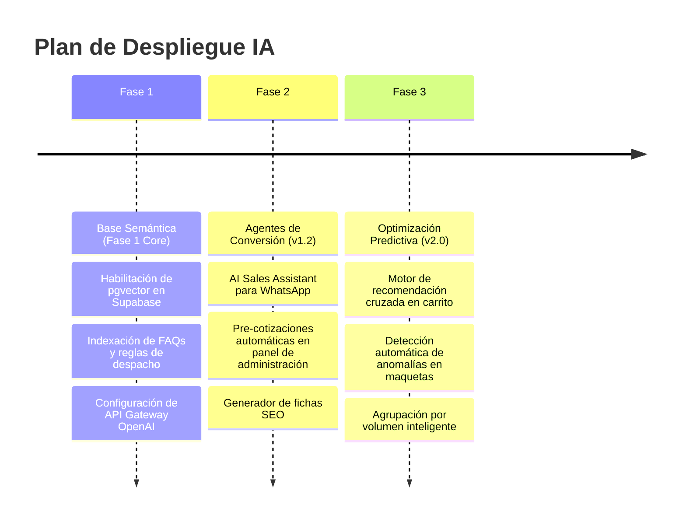

# AI & Automation Roadmap
## Papelería y Creaciones E&G — Plan de Implementación de Inteligencia Artificial

---

## 1. Fases de Despliegue de Automatización Inteligente

El roadmap de IA se divide en **3 fases estructuradas**, vinculadas a la madurez de la plataforma de producción del e-commerce:

---

## 2. Dependencias y Prioridades de Desarrollo

| Fase | Módulo / Automatización | Dependencia Técnica Directa | Impacto Esperado | Prioridad |
| :---: | :--- | :--- | :--- | :--- |
| **Fase 1** | Motor de recomendación SEO | Tablas `products` y `categories` pobladas. | Aceleración del copywriting de 5 horas a 1 minuto por ficha. | **Alta** |
| **Fase 2** | AI Sales Assistant | API oficial de WhatsApp Cloud funcionando. | Reducción del 60% en chats iniciales manuales redundantes. | **Media** |
| **Fase 2** | Asistente de Cotización | Base de datos con historial de cotizaciones (`quotes`). | Incremento del ticket promedio (AOV) al sugerir packs óptimos. | **Media** |
| **Fase 3** | Visión Artificial (Anomalías) | Módulo `user_designs` funcionando y clasificado. | Eliminación de desperdicios de material en impresión por pixelado. | **Baja** |

---

## 3. Estrategia de Mitigación de Desviación de Alucinación (Guardrails)

Para evitar respuestas incorrectas en el chatbot del cliente (ej: Prometer envíos gratuitos fuera de la cobertura estándar o precios de catálogo erróneos):

*   **Filtros de Temperatura Cero:** Llamadas a la API del LLM configuradas con `temperature: 0` para garantizar respuestas deterministas y consistentes basadas en la base de datos de conocimiento estricto de Supabase.
*   **Prompt System Inyectado:** Cada llamada de conversación incluirá una cláusula limitante: *"Si no encuentras el valor exacto de envío o precio del producto en la base de conocimiento provista, transfiere amigablemente el chat a un agente de atención humana"*.
