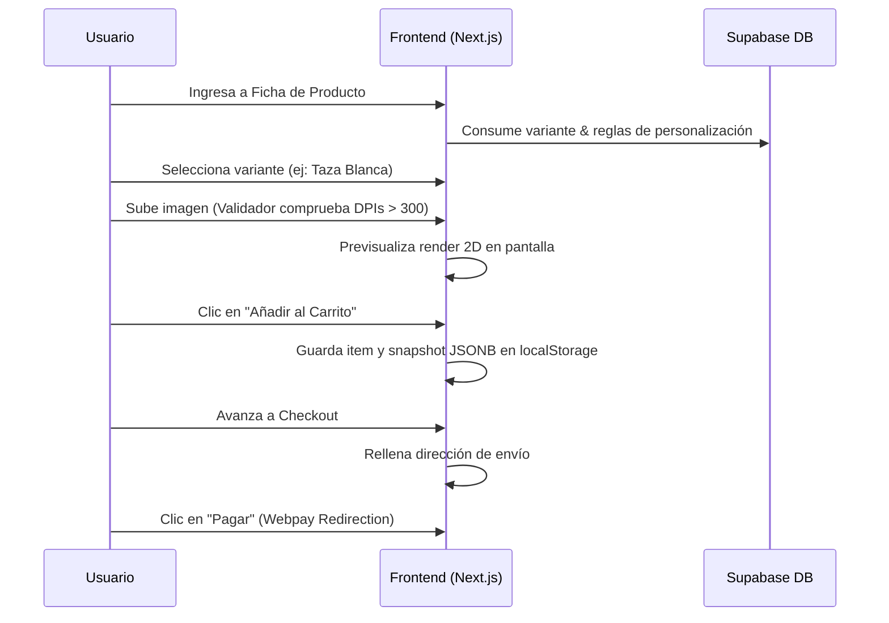
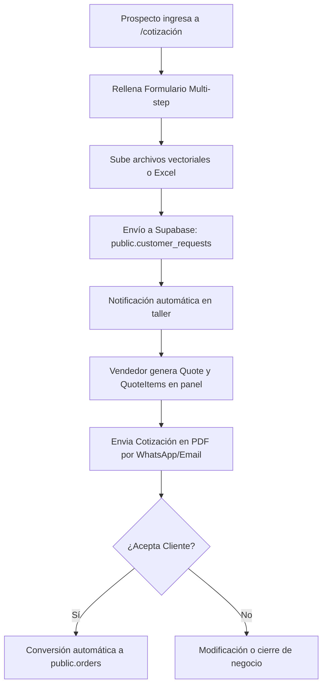

# Customer Experience Flows & User Journeys
## Papelería y Creaciones E&G — Caminos de Conversión e Interacción del Cliente

---

## 1. Flujo Transaccional de Compra (E-commerce Core)

Describe la ruta que realiza un cliente estándar (ej. Camila) al adquirir un producto base o personalizado:

---

## 2. Flujo de Cotización Consultiva (B2B / Instituciones)

Describe la ruta para clientes como Nicolás o María Teresa que requieren presupuestos formales:

---

## 3. Puntos de Contacto Críticos (Touchpoints)

*   **Paso de Carga de Archivos:** La validación debe ocurrir en tiempo real en la pantalla del usuario (Client-side validation). Si el archivo no tiene transparencias o es menor a 300 DPI, la interfaz lo detiene inmediatamente antes de permitir el pago, explicando amigablemente la solución técnica.
*   **Confirmación de Pago Inmediata:** Tras retornar del banco (Webpay), el cliente visualiza una pantalla limpia con su número de orden (`order_number`) y un botón para contactar directo al WhatsApp de soporte ante dudas.
*   **Encuestas de Satisfacción:** Un webhook en Supabase gatilla una notificación de WhatsApp al cabo de 5 días de la entrega física del Courier para capturar su testimonio y foto del producto final.
