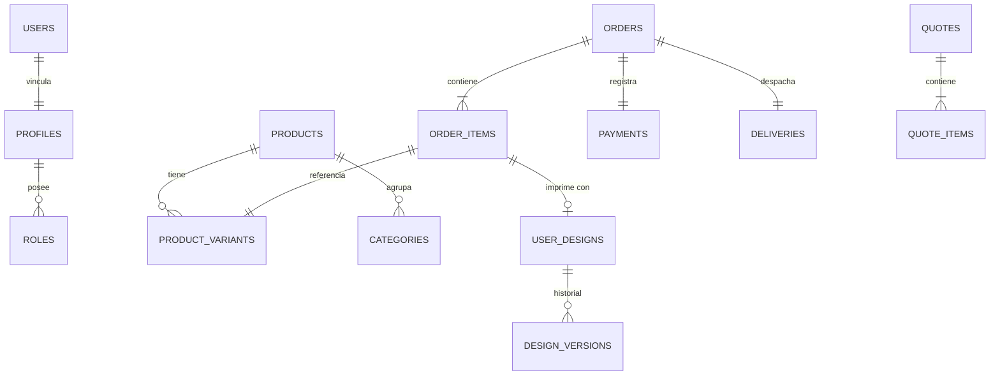

# Database Architecture & PostgreSQL Schema Blueprint
## Papelería y Creaciones E&G — Plano de Datos y Políticas de Seguridad

---

## 1. Arquitectura General de Datos

El diseño de la base de datos de **Papelería y Creaciones E&G** en Supabase PostgreSQL sigue un modelo relacional estricto con un alto grado de normalización, garantizando la integridad referencial y permitiendo consultas rápidas a través de índices específicos. Las opciones dinámicas de personalización y las variantes complejas se modelan utilizando campos JSONB estructurados para conservar flexibilidad sin comprometer la estructura básica de las tablas.



---

## 2. Enums del Sistema (Estados Oficiales)

Para mantener la integridad de los flujos de negocio, se utilizarán tipos enumerados (`enums`) nativos de PostgreSQL:

*   **`user_role_type`:** `admin`, `designer`, `production`, `sales`, `customer`.
*   **`product_status_type`:** `draft`, `active`, `archived`.
*   **`order_production_status_type`:** `created`, `paid`, `in_queue`, `printing`, `cutting`, `quality_check`, `ready_to_ship`, `shipped`, `delivered`, `canceled`.
*   **`payment_status_type`:** `pending`, `authorized`, `captured`, `failed`, `refunded`.
*   **`quote_status_type`:** `draft`, `submitted`, `under_review`, `sent_to_client`, `accepted`, `rejected`, `expired`.
*   **`design_status_type`:** `draft`, `submitted`, `approved`, `rejected`.

---

## 3. Modelo Relacional y Estructura de Tablas

### 3.1. Dominio de Identidad y Clientes

#### Tabla: `profiles`
*   **Propósito:** Almacena información complementaria de las cuentas creadas en Supabase Auth (`auth.users`).
*   **Estructura:**
    *   `id`: `uuid` (Primary Key, Foreign Key ➔ `auth.users.id` con eliminación en cascada).
    *   `first_name`: `varchar(100)` (Not Null).
    *   `last_name`: `varchar(100)` (Not Null).
    *   `phone`: `varchar(20)`.
    *   `role`: `user_role_type` (Default: `customer`).
    *   `created_at`: `timestamp with time zone` (Default: `now()`).
*   **Índices:** B-Tree sobre `role`.

#### Tabla: `customers`
*   **Propósito:** Datos específicos de clientes comerciales B2B o institucionales (colegios/Pymes).
*   **Estructura:**
    *   `id`: `uuid` (Primary Key).
    *   `profile_id`: `uuid` (Foreign Key ➔ `profiles.id`).
    *   `company_name`: `varchar(200)` (Nullable para B2C).
    *   `rut`: `varchar(12)` (RUT Chileno único, Nullable para B2C).
    *   `billing_address`: `jsonb` (Dirección fiscal de facturación).
    *   `is_b2b_approved`: `boolean` (Default: `false`).

---

### 3.2. Dominio de Catálogo

#### Tabla: `products`
*   **Propósito:** Productos base del catálogo.
*   **Estructura:**
    *   `id`: `uuid` (Primary Key).
    *   `slug`: `varchar(150)` (Unique, Indexado).
    *   `title`: `varchar(200)` (Not Null).
    *   `description`: `text`.
    *   `base_price`: `integer` (En pesos chilenos CLP, sin decimales).
    *   `is_customizable`: `boolean` (Default: `false`).
    *   `status`: `product_status_type` (Default: `draft`).
*   **Índices:** B-Tree sobre `slug`, `status`.

#### Tabla: `product_variants`
*   **Propósito:** Combinaciones de atributos que definen variaciones físicas (tamaño, color, encuadernación).
*   **Estructura:**
    *   `id`: `uuid` (Primary Key).
    *   `product_id`: `uuid` (Foreign Key ➔ `products.id` con eliminación en cascada).
    *   `sku`: `varchar(100)` (Unique).
    *   `stock_quantity`: `integer` (Default: `0`).
    *   `price_adjustment`: `integer` (Monto a sumar/restar al `base_price` del producto).
    *   `variant_attributes`: `jsonb` (Atributos estructurados ej: `{"color": "Rose", "size": "A5"}`).

---

### 3.3. Dominio de Personalización

#### Tabla: `customization_options`
*   **Propósito:** Especificación de límites y tipos de personalización para el configurador interactivo.
*   **Estructura:**
    *   `id`: `uuid` (Primary Key).
    *   `product_id`: `uuid` (Foreign Key ➔ `products.id` con eliminación en cascada).
    *   `max_files`: `integer` (Default: `1`).
    *   `allowed_formats`: `varchar(50)[]` (Mime-types permitidos, ej. `['image/png', 'application/pdf']`).
    *   `min_dpi`: `integer` (Default: `300`).
    *   `canvas_width_mm`: `integer`.
    *   `canvas_height_mm`: `integer`.

#### Tabla: `user_designs`
*   **Propósito:** Archivo de diseño definitivo o lienzo estructurado por el cliente para un pedido.
*   **Estructura:**
    *   `id`: `uuid` (Primary Key).
    *   `customer_id`: `uuid` (Foreign Key ➔ `profiles.id`).
    *   `file_path`: `text` (URL del bucket privado en Supabase Storage).
    *   `resolution_dpi`: `integer`.
    *   `dimensions_px`: `varchar(50)`.
    *   `is_vector`: `boolean` (Default: `false`).
    *   `status`: `design_status_type` (Default: `draft`).
    *   `current_version`: `integer` (Default: `1`).
*   **Índices:** B-Tree sobre `customer_id`.

#### Tabla: `design_versions`
*   **Propósito:** Historial de correcciones y nuevas versiones subidas de un diseño tras rechazos por baja resolución.
*   **Estructura:**
    *   `id`: `uuid` (Primary Key).
    *   `design_id`: `uuid` (Foreign Key ➔ `user_designs.id` con eliminación en cascada).
    *   `version_number`: `integer` (Not Null).
    *   `file_path`: `text` (Enlace al archivo corregido).
    *   `reason_for_change`: `text` (Comentario del diseñador administrativo sobre por qué se subió esta versión).
    *   `created_at`: `timestamp with time zone` (Default: `now()`).

---

### 3.4. Dominio de Ventas, Pedidos y Cobros

#### Tabla: `orders`
*   **Propósito:** Registra las transacciones confirmadas.
*   **Estructura:**
    *   `id`: `uuid` (Primary Key).
    *   `order_number`: `serial` (Correlativo autoincremental secuencial).
    *   `customer_id`: `uuid` (Foreign Key ➔ `profiles.id`).
    *   `total_amount`: `integer`.
    *   `shipping_cost`: `integer`.
    *   `shipping_address`: `jsonb` (Dirección final de destino).
    *   `payment_status`: `payment_status_type` (Default: `pending`).
    *   `production_status`: `order_production_status_type` (Default: `created`).
    *   `created_at`: `timestamp with time zone`.
*   **Índices:** B-Tree sobre `customer_id`, `payment_status`, `production_status`.

#### Tabla: `order_items`
*   **Propósito:** Detalle de productos incluidos en un pedido.
*   **Estructura:**
    *   `id`: `uuid` (Primary Key).
    *   `order_id`: `uuid` (Foreign Key ➔ `orders.id` con eliminación en cascada).
    *   `variant_id`: `uuid` (Foreign Key ➔ `product_variants.id`).
    *   `design_id`: `uuid` (Foreign Key ➔ `user_designs.id` - Nullable para productos estándar).
    *   `quantity`: `integer` (Not Null).
    *   `unit_price`: `integer` (Precio final unitario cobrado).
    *   `customization_snapshot`: `jsonb` (Copia exacta de los textos y configuraciones ingresados en el canvas).

#### Tabla: `payments`
*   **Propósito:** Historial de transacciones de la pasarela de pagos.
*   **Estructura:**
    *   `id`: `uuid` (Primary Key).
    *   `order_id`: `uuid` (Foreign Key ➔ `orders.id`).
    *   `transaction_id`: `varchar(200)` (Código de retorno de Transbank/MercadoPago).
    *   `amount`: `integer`.
    *   `payment_method`: `varchar(50)` (Debito, Credito, CuentaRUT).
    *   `status`: `payment_status_type`.
    *   `gateway_response`: `jsonb` (Respuesta JSON bruta de la pasarela para auditoría).

---

## 4. Políticas de Seguridad Row Level Security (RLS)

La seguridad de datos se gestiona a nivel de motor PostgreSQL mediante políticas RLS. El acceso se valida comparando el ID de sesión del usuario con el campo propietario:

### Tabla: `profiles`
*   **Acceso Lectura:** `auth.uid() == id` (El usuario solo lee su perfil).
*   **Acceso Escritura:** `auth.uid() == id` (El usuario solo actualiza su perfil).
*   **Excepción:** Roles `admin` y `sales` pueden leer y escribir sobre cualquier perfil.

### Tabla: `user_designs`
*   **Acceso Lectura:** `auth.uid() == customer_id` (El cliente lee sus diseños).
*   **Acceso Escritura:** `auth.uid() == customer_id` (Solo escribe sobre sus recursos).
*   **Excepción:** Roles `admin` y `designer` tienen bypass total de lectura para inspección y descarga técnica en taller.

### Tabla: `orders`
*   **Acceso Lectura:** `auth.uid() == customer_id` (Historial personal de compras).
*   **Acceso Escritura:** Bloqueado para todos en producción (Solo se altera mediante Server Actions administrativas autenticadas tras webhooks de pasarela certificados).

---

## 5. Auditoría de Datos (`audit_logs`)

Para registrar cambios sensibles y asegurar la trazabilidad del taller de Papelería y Creaciones E&G:

```text
Tabla: audit_logs
├── id: uuid (Primary Key)
├── table_name: varchar(100) (ej. "orders", "product_variants")
├── record_id: uuid (Identificador del registro alterado)
├── action: varchar(50) (INSERT, UPDATE, DELETE)
├── old_value: jsonb (Estado de la fila antes del cambio)
├── new_value: jsonb (Estado de la fila después del cambio)
├── performed_by: uuid (profiles.id del responsable)
└── created_at: timestamp with time zone (Default: now())
```

*   **Trigger en PostgreSQL:** Un trigger global interceptará los eventos `UPDATE` en las tablas `orders` y `user_designs` para poblar de manera automática `audit_logs`, impidiendo la alteración manual del log de auditoría.

---

## 6. Escalabilidad Futura (Diseño Preventivo)

*   **Marketplace B2B:** La tabla `products` incluye un campo indexado opcional `vendor_id`. Si se escala a un modelo multi-proveedor, las vistas del taller de producción filtrarán las órdenes usando `vendor_id == auth.uid()`.
*   **Multiempresa / Sucursales:** El stock de las variantes en `product_variants` puede aislarse extrayendo la columna `stock_quantity` hacia una tabla pivote `branch_inventory` vinculada a un ID de bodega física (`branch_id`).
