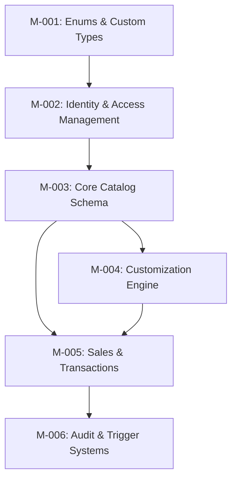
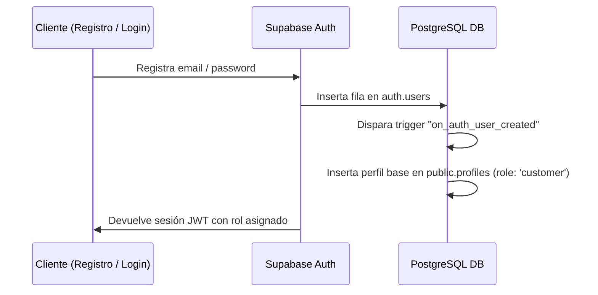

# Database Implementation Plan & Migration Roadmap
## Papelería y Creaciones E&G — Plan de Despliegue de Datos en Supabase

---

## 1. Orden de Implementación y Plan de Migraciones

Para garantizar la integridad referencial y evitar dependencias circulares, la base de datos se desplegará en **6 migraciones incrementales lógicas**:

### Detalle de las Migraciones:
1.  **`M-001_initial_types`:** Creación de los tipos enums PostgreSQL globales (`user_role_type`, `payment_status_type`, `order_production_status_type`, etc.).
2.  **`M-002_identity_profiles`:** Creación de la tabla `profiles` (ligada a `auth.users`) y la tabla `customers`. Setup de roles iniciales.
3.  **`M-003_catalog_base`:** Estructuración de `products` y `product_variants` con sus respectivos índices B-Tree y GIN para búsquedas.
4.  **`M-004_customization_rules`:** Creación de `customization_options`, `user_designs` y `design_versions` para albergar lienzos del cliente.
5.  **`M-005_sales_orders`:** Estructuración de `orders`, `order_items` y `payments` para habilitar el flujo transaccional.
6.  **`M-006_audit_triggers`:** Creación de la tabla de logs `audit_logs` y los triggers PostgreSQL automáticos de actualización y auditoría.

---

## 2. Inventario de Tablas a Crear

| Orden | Nombre de Tabla | Dependencias Directas | Importancia | Rol Principal |
| :---: | :--- | :--- | :--- | :--- |
| **1** | `profiles` | `auth.users` | Crítica | Vincula la sesión auth de Supabase con los roles del negocio. |
| **2** | `customers` | `profiles` | Alta | Almacena datos fiscales (RUT/B2B) de Pymes y colegios. |
| **3** | `products` | Ninguna | Crítica | Entidad núcleo del catálogo web. |
| **4** | `product_variants` | `products` | Crítica | Permite el manejo de stock y SKUs por tamaño y color. |
| **5** | `customization_options`| `products` | Alta | Define los límites del canvas interactivo. |
| **6** | `user_designs` | `profiles` | Crítica | Almacena los links de los assets vectoriales subidos. |
| **7** | `design_versions` | `user_designs` | Media | Control de versiones para resolver archivos pixelados. |
| **8** | `orders` | `profiles` | Crítica | Registro financiero y operativo del pedido. |
| **9** | `order_items` | `orders`, `product_variants`, `user_designs` | Crítica | Detalle y snapshop del lienzo personalizado comprado. |
| **10**| `payments` | `orders` | Alta | Registra respuestas brutas de Webpay/MercadoPago. |
| **11**| `audit_logs` | `profiles` | Alta | Registro inmutable de acciones críticas del sistema. |

---

## 3. Estrategia de Supabase Auth & Perfiles de Usuario

El flujo de autenticación sincroniza de forma automática a los usuarios registrados en Supabase Auth con la tabla `profiles` mediante un trigger a nivel de base de datos:

### Políticas RLS Clave por Rol:
*   **Customer:** Solo lee su propia fila en `profiles` y escribe en sus diseños.
*   **Designer:** Bypass de lectura en `user_designs` para corregir/validar archivos pixelados.
*   **Production:** Escritura en `orders.production_status` para operar el taller físico.
*   **Admin:** Control absoluto de tablas y políticas en el esquema `public`.

---

## 4. Estructura y Políticas de Supabase Storage

Se crearán tres buckets con las siguientes directivas de seguridad RLS:

### Bucket `product-catalog` (Público)
*   *Uso:* Fotos del catálogo.
*   *Políticas RLS:*
    *   Lectura: Permitido para todos (anónimos y autenticados).
    *   Escritura: Permitido únicamente para usuarios autenticados con rol `admin` o `designer` en `profiles`.

### Bucket `client-designs` (Privado)
*   *Uso:* Archivos vectoriales y Excel subidos por clientes.
*   *Políticas RLS:*
    *   Lectura: Permitido al propietario del diseño (`auth.uid() == owner_id`) y a roles `admin`, `designer` o `production`.
    *   Escritura: Permitido al propietario del diseño (`auth.uid() == owner_id`).

---

## 5. Datos Iniciales de Carga (Seeds)

Al ejecutar la migración inicial, se poblarán las tablas con los siguientes datos de catálogo y taxonomías base:

*   **Categorías Base:** `stickers` (etiquetas), `regalos-personalizados` (tazas, packs), `papeleria-escolar` (planners, agendas), `insumos-pyme` (DTF UV, cintas de embalaje).
*   **Parámetros de Configuración Global:** Tarifas de envío base por región de Chile, límites de tamaño para carga de imágenes en el cliente (ej: 50MB máximo).

---

## 6. Riesgos Técnicos y Estrategia de Mitigación

*   **Riesgo 1: Pérdida de resolución al actualizar diseños.** Si el cliente cambia de parecer tras un rechazo del taller, y el diseñador sobrescribe el archivo original, se pierde la trazabilidad de la orden.
    *   *Mitigación:* Se implementa un historial inmutable en `design_versions` que bloquea la sobreescritura física de los archivos antiguos en Supabase Storage, conservando el histórico de maquetas.
*   **Riesgo 2: Bloqueo de consultas por indexado deficiente de JSONB.** El uso de campos JSONB para variantes puede ralentizar el catálogo al crecer a miles de productos.
    *   *Mitigación:* Se aplicarán índices de tipo GIN (`gin(variant_attributes)`) y se documentará que los atributos compartidos comunes (ej: color, tamaño) deben mantenerse consistentes en su nomenclatura.

---

## 7. Checklist de Pre-Implementación

*   [x] Arquitectura de datos validada en `DATABASE_ARCHITECTURE.md`.
*   [x] Jerarquía de dependencias estructurada en orden secuencial sin dependencias circulares.
*   [x] Definidas todas las políticas RLS y roles requeridos para el negocio.
*   [x] Estructurados los buckets y directorios del Storage de Supabase.
