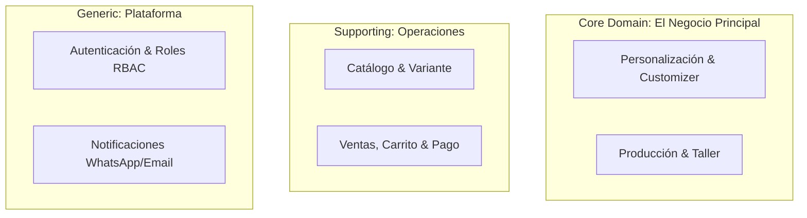
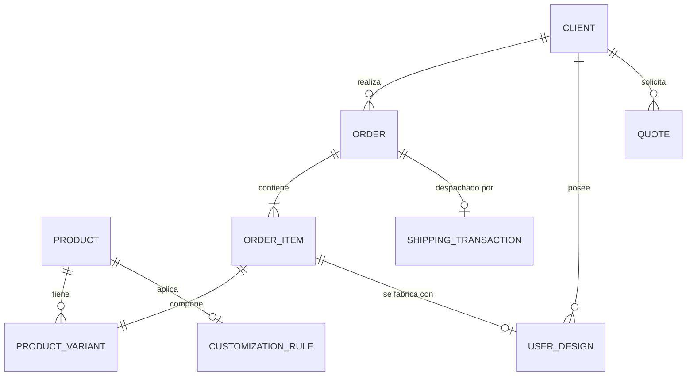

# Domain Model & Conceptual Architecture
## Papelería y Creaciones E&G — Modelo de Dominio y Reglas del Backend

---

## 1. División en Dominios (Subdominios DDD)

El sistema de Papelería y Creaciones E&G se modela utilizando **Domain-Driven Design (DDD)**, dividiéndose en los siguientes subdominios lógicos autónomos:



1.  **Catálogo (Catalog Domain):** Gestión de productos estándar, taxonomías, categorías y combinaciones estáticas de variantes (ej. tamaños de papel, colores de tinta).
2.  **Personalización (Customization Domain):** El motor dinámico. Modela lienzos de diseño, carga de assets del cliente, validaciones de calidad de imagen y gestión de versiones de maquetas para impresión.
3.  **Ventas y Cobros (Sales Domain):** Manejo del carrito de compras transitorio, checkout, cálculo de despacho dinámico e integración con pasarelas transaccionales.
4.  **Producción (Production Domain):** Gestión del flujo de trabajo dentro del taller. Conversión de órdenes en hojas de trabajo ("Job Sheets"), asignación de estados físicos e impresión.
5.  **Usuarios y Roles (Identity Domain):** Control de acceso basado en roles (RBAC) y perfiles del cliente en Supabase Auth.
6.  **Soporte y Postventa (Support Domain):** Centro de ayuda, reclamos de reposición por fallos físicos de producción y flujos de calificación post-entrega.

---

## 2. Definición Detallada de Entidades del Dominio

---

### Entidad: Producto (`Product`)
*   **Dominio:** Catálogo.
*   **Descripción:** Representa un artículo base ofrecido en la tienda.
*   **Campos Principales:** `id`, `slug`, `title`, `description` (Markdown), `base_price`, `tax_category`, `is_customizable`, `is_active`.
*   **Estados Posibles:** `Draft` (Edición), `Active` (Público), `Archived` (Descontinuado).
*   **Reglas de Negocio:** Si `is_customizable` es verdadero, debe enlazarse obligatoriamente a una regla de personalización (`CustomizationRule`).

---

### Entidad: Variante de Producto (`ProductVariant`)
*   **Dominio:** Catálogo.
*   **Descripción:** Combinación específica de atributos físicos de un producto.
*   **Campos Principales:** `id`, `product_id`, `sku` (Código único), `stock_quantity`, `price_adjustment` (Valor adicional sobre el precio base), `variant_metadata` (jsonb de atributos ej: color, tamaño).
*   **Estados Posibles:** `In_Stock`, `Out_of_Stock`, `Discontinued`.
*   **Reglas de Negocio:** El SKU debe ser único a nivel global de la plataforma.

---

### Entidad: Regla de Personalización (`CustomizationRule`)
*   **Dominio:** Personalización.
*   **Descripción:** Define los límites físicos, técnicos y de archivos permitidos para un producto personalizado.
*   **Campos Principales:** `id`, `product_id`, `max_files`, `allowed_extensions` (Mime-types permitidos), `min_dpi`, `max_dimensions_px`, `customization_options` (jsonb de materiales, relieves o tintas especiales seleccionables en el canvas).
*   **Estados Posibles:** `Active`, `Inactive`.
*   **Reglas de Negocio:** Valida la entrada en el cargador del cliente antes de permitir añadir el producto al carrito.

---

### Entidad: Diseño del Cliente (`UserDesign`)
*   **Dominio:** Personalización.
*   **Descripción:** El archivo y conjunto de metadatos de personalización aportado por el cliente.
*   **Campos Principales:** `id`, `customer_id`, `file_url` (Apuntando a Supabase Storage), `resolution_dpi`, `dimensions_px`, `is_vector`, `version_number`, `parent_design_id`.
*   **Estados Posibles:** `Draft` (En edición cliente), `Submitted` (Subido a orden), `Approved_For_Production` (Validado por taller), `Rejected` (Error de resolución).
*   **Reglas de Negocio:** Un diseño aprobado para producción es **inmutable**. Si el cliente requiere cambiar algo antes de imprimir, se genera una nueva fila incrementando el `version_number` referenciando al diseño original en `parent_design_id`.

---

### Entidad: Pedido (`Order`)
*   **Dominio:** Ventas & Producción.
*   **Descripción:** El contrato transaccional y operativo de compra.
*   **Campos Principales:** `id`, `order_number` (Correlativo legible), `customer_id`, `total_amount`, `shipping_cost`, `shipping_address` (jsonb), `courier_tracking_id`, `payment_status`, `production_status`.
*   **Estados Posibles:** `Created`, `Paid`, `In_Queue`, `Printing`, `Ready_To_Ship`, `Shipped`, `Delivered`, `Canceled`.
*   **Reglas de Negocio:** No se puede iniciar la fase de producción si el pago no está confirmado (`Paid` o crédito B2B aprobado).

---

### Entidad: Cotización (`Quote`)
*   **Dominio:** Ventas B2B.
*   **Descripción:** Solicitud de presupuesto por volumen enviada por colegios o Pymes.
*   **Campos Principales:** `id`, `quote_number`, `customer_id`, `requested_items` (jsonb), `proposed_price`, `expiration_date`, `status`.
*   **Estados Posibles:** `Draft`, `Submitted`, `Under_Review`, `Sent_To_Client`, `Accepted`, `Rejected`, `Converted_To_Order`.
*   **Reglas de Negocio:** Una cotización aceptada se convierte automáticamente en una orden (`Order`) inyectando los datos de los items cotizados al carrito final.

---

## 3. Relaciones entre Entidades (Mermaid ERD)



### Detalle de las Relaciones Críticas:
*   **`ORDER_ITEM` ➔ `USER_DESIGN` (1:0..1):** Un item de orden puede o no tener asociado un diseño personalizado. Si el cliente compra una libreta lista para enviar de catálogo, no requiere diseño asociado. Si compra etiquetas DTF UV, la relación es obligatoria (1:1).
*   **`PRODUCT` ➔ `CUSTOMIZATION_RULE` (1:0..1):** Define qué opciones de personalización (materiales, límites de archivos, rangos de colores) están disponibles para ese producto en la interfaz del configurador.

---

## 4. Ciclos de Estado del Sistema (State Machines)

### Ciclo de Estados de un Pedido (`Order`)
```text
[Created] ➔ [Paid] ➔ [In_Queue] ➔ [Printing] ➔ [Ready_To_Ship] ➔ [Shipped] ➔ [Delivered]
             ↳ [Payment_Failed]               ↳ [Production_Error]
```

### Ciclo de Estados de una Cotización B2B (`Quote`)
```text
[Draft] ➔ [Submitted] ➔ [Under_Review] ➔ [Sent_To_Client] ➔ [Accepted] ➔ [Converted_To_Order]
                                         ↳ [Rejected]
```

---

## 5. El Sistema de Personalización Avanzado

Para estructurar la personalización digital, el configurador interactivo vincula las opciones de materiales, colores y notas a nivel de item individual mediante un esquema de metadatos acotado:

```json
{
  "canvas_options": {
    "material": "Opalina 240g",
    "foil_color": "Dorado Metálico",
    "corner_roundness": "4mm"
  },
  "user_notes": "Favor centrar el logo en la portada trasera e incluir tarjeta de regalo",
  "mockup_preview_url": "https://storage.supabase.co/mockups/order_123.jpg"
}
```

### Flujo de Aprobación de Diseños:
1.  **Carga y Validación:** El cliente carga su archivo. Un script del cliente comprueba la resolución y transparencias basadas en `CustomizationRule`.
2.  **Generación de Previsualización:** Se genera una maqueta digital temporal en formato PNG.
3.  **Aprobación del Taller:** Al confirmarse la compra, el diseñador de Creaciones E&G valida en su dashboard administrativo el diseño. Si la resolución es baja, marca el diseño como `Rejected`, gatillando una notificación al cliente vía WhatsApp para que suba una versión corregida (`version_number` incrementado).

---

## 6. Auditoría y Trazabilidad (Audit Logs)

La trazabilidad es clave para dirimir disputas con clientes y evaluar cuellos de botella de producción. Toda acción crítica se registra en la tabla conceptual `AuditLog`:

```text
Entidad: AuditLog
├── id: UUID
├── timestamp: Timestamp
├── user_id: UUID (Responsable de la acción)
├── event_type: String (ej: "ORDER_STATUS_CHANGED", "DESIGN_REJECTED", "PRICE_MODIFIED")
├── resource_id: UUID (Referencia al recurso afectado)
├── previous_state: jsonb
└── current_state: jsonb
```

---

## 7. Escalabilidad y Futuras Expansiones

El modelo conceptual se diseñó previendo los siguientes hitos de escalabilidad sin necesidad de refactorizar la estructura de datos principal:

*   **Multiempresa / Marketplace B2B:** La entidad `Product` y `Order` poseen un campo opcional `vendor_id`. En el futuro, otros talleres de personalización podrán vender a través de la plataforma, filtrando las órdenes en el dashboard del taller por vendedor de manera automática.
*   **Múltiples Sucursales / Inventarios Locales:** La cantidad de stock se desplaza de la tabla `ProductVariant` a una subtabla `InventoryStock` que vincula `variant_id` con `branch_id`, permitiendo controlar existencias independientes para tiendas físicas en Santiago u otras regiones.
*   **Integración CRM e IA:** Al estar estructurados los pedidos y comportamientos en subdominios limpios, se puede integrar fácilmente un agente de IA que analice los patrones de compra de Nicolás (Pyme) y María Teresa (Colegios) para sugerir compras de reabastecimiento programadas basadas en su frecuencia de consumo histórico.

---

## 8. Preparación para la Base de Datos (Recomendaciones PostgreSQL)

1.  **Uso de Campos `jsonb` para Variantes y Metadatos:** Los atributos de variantes altamente dinámicos (colores específicos de temporada, accesorios) deben guardarse en un campo `jsonb` indexado mediante GIN (`Generalized Inverted Index`) en PostgreSQL para permitir consultas fluidas sin crear docenas de columnas vacías.
2.  **Seguridad a Nivel de Fila (RLS) en Supabase:**
    *   La tabla `profiles` y `user_images` deben poseer políticas RLS restrictivas: `auth.uid() == user_id` para garantizar que ningún usuario acceda a archivos privados de otro cliente.
3.  **Auditoría Estricta (Auditing Triggers):** Toda tabla transaccional (`orders`, `user_designs`) debe poseer un trigger en PostgreSQL que guarde el historial de cambios de estado en una tabla de auditoría (`audit_logs`), registrando la fecha exacta y el identificador de sesión del usuario responsable (`auth.uid()`).
