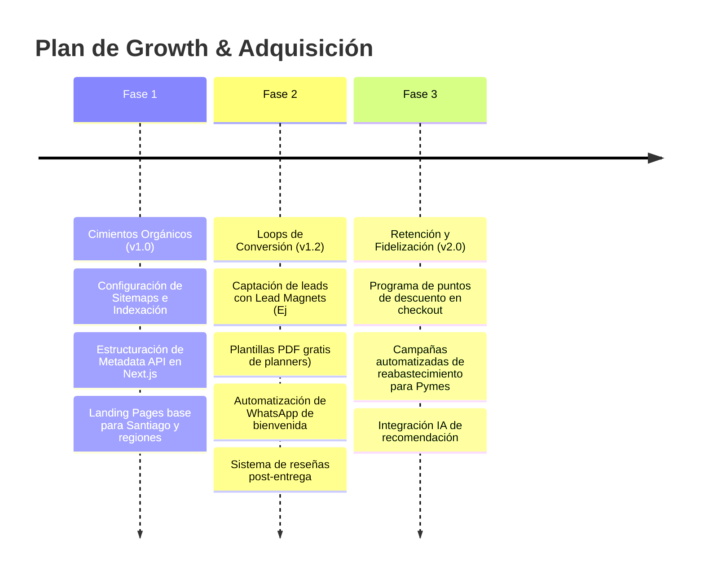

# Growth Engine & Marketing Roadmap
## Papelería y Creaciones E&G — Plan de Adquisición y Loops de Crecimiento

---

## 1. Fases de Desarrollo de Growth & SEO

La adquisición y el marketing de fidelización se desarrollarán en **3 fases estructuradas**:

---

## 2. Loops de Adquisición y Virilidad (Viral Loops)

*   **El Loop de Recomendación del Diseñador (B2B):** Al entregar un pedido de stickers DTF UV o empaques personalizados para un emprendedor (Nicolás), la marca del packaging del unboxing incluye una pequeña tarjeta con el QR: *"¿Quieres empaques como estos para tu marca? Escanea y recibe un 10% de descuento en tu primera compra"*. Esto convierte cada despacho B2B en un imán de nuevos prospectos comerciales similares.
*   **User-Generated Content Loop (B2C):** Incentivo del 5% de descuento en el próximo pedido si el cliente comparte un reel o historia etiquetando el unboxing de su álbum de fotos en Instagram.

---

## 3. KPIs del Motor de Crecimiento

Para evaluar la rentabilidad del activo digital, se medirán las siguientes métricas clave en un panel ejecutivo integrado:

1.  **Organic CTR:** Ratio de clics en resultados orgánicos de Google orientados a palabras clave transaccionales locales.
2.  **Conversion Rate by Channel:** Tasa de conversión de compras desglosada por canal (Tráfico directo, Tráfico de búsqueda orgánica, WhatsApp Business, Redes sociales).
3.  **LTV/CAC Ratio:** Valor de vida útil del cliente dividido por el costo de adquisición. Meta del activo digital: Ratio > 3.5 en el segmento B2B Pymes al cabo de 12 meses de operación.
