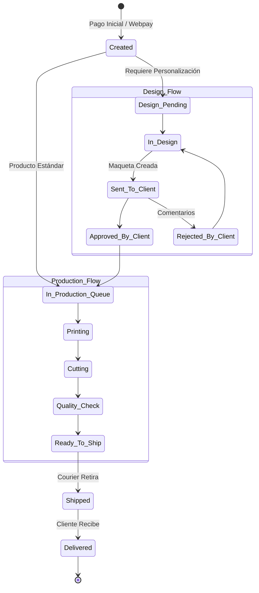

# Order & Production Engine Architecture
## Papelería y Creaciones E&G — Fase 4: Estructura de Pedidos y Flujos de Producción en Taller

---

## 1. Modelo de Entidades y Relaciones

El subdominio de Pedidos y Producción actúa como el ERP ligero para canalizar las ventas confirmadas hacia la manufactura física en el taller:

*   **`orders` & `order_items`:** Documentos transaccionales definitivos que respaldan la compra. `order_items` incluye una copia estática de las personalizaciones del cliente (`customization_snapshot`) para evitar inconsistencias si el producto base se modifica en el catálogo con posterioridad.
*   **`design_projects` & `design_versions`:** Gestiona el flujo del diseñador interno (ej. ajuste de márgenes de corte, maquetado de fotolibro). Almacena las iteraciones de maquetas.
*   **`customer_approvals`:** Permite al cliente aprobar la maqueta antes de imprimir o agregar comentarios de rechazo.
*   **`production_jobs`:** Cola de tareas del taller físico. Asigna prioridades (urgencias de última hora) y operarios.
*   **`deliveries`:** Gestión logística de reparto, control de couriers y tracking.

---

## 2. Flujos Operativos y Transición de Estados

---

## 3. Seguridad de Datos y Row Level Security (RLS)

*   **Clientes (Lectura de Pedidos):**
    *   Un cliente autenticado tiene permiso exclusivo de lectura sobre sus propios pedidos (`orders`), items, maquetas de diseño (`design_projects`) y tramos de reparto (`deliveries`).
    *   Es el único que puede insertar registros en `customer_approvals` para dar luz verde a la producción de sus maquetas.
*   **Taller y Diseñadores (Escritura):**
    *   El rol `designer` posee permisos de escritura total sobre `design_projects` y `design_versions`.
    *   El rol `production` posee permisos para actualizar la tabla `production_jobs` e inyectar logs en `production_history`.
*   **Público:**
    *   No tiene acceso a ninguna de estas tablas protegidas.
