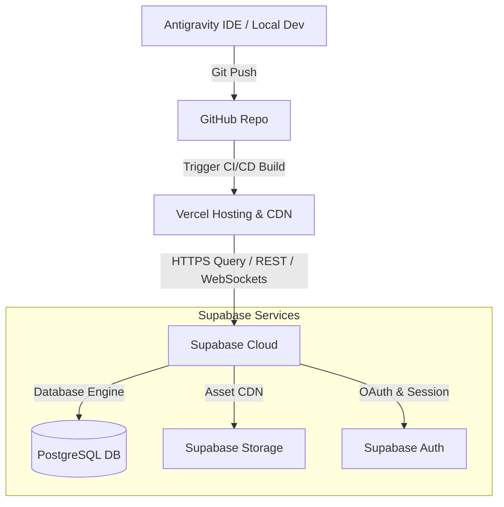

# Environment Configuration & Infrastructure Blueprint
## Papelería y Creaciones E&G — Plataforma de Producción y Flujos de Despliegue

---

## 1. Mapa de Infraestructura Cloud

La plataforma de **Papelería y Creaciones E&G** opera bajo una arquitectura desacoplada, utilizando servicios gestionados de primer nivel para maximizar el rendimiento, la seguridad y la velocidad de entrega en producción.



### Tabla de Responsabilidades de la Infraestructura

| Componente | Plataforma / URL Oficial | Responsabilidad Clave |
| :--- | :--- | :--- |
| **Repositorio** | [GitHub Repo](https://github.com/papeleriaycreacioneeyg-hue/CreacionesEyG) | Control de versiones, ramas de trabajo, revisión de Pull Requests y resguardo de la base de código. |
| **Hosting & CI/CD**| [Vercel Project](https://vercel.com/papeleriay-creaciones-ey-g) | Servidor Next.js Node/Serverless, CDN de distribución global, compilación automática e inyección de variables de entorno de producción. |
| **BaaS & DB** | [Supabase Project](https://supabase.com/dashboard/project/jubzyrhitzqnlgcolydy) | Motor PostgreSQL, autenticación de usuarios, buckets de almacenamiento (Storage) y políticas de seguridad RLS. |

---

## 2. Flujo de Trabajo y Pipeline de Despliegue (Git Flow)

El ciclo de desarrollo técnico se rige bajo la siguiente jerarquía de ramas de Git:

1.  **Rama `main` (Producción):** Representa el estado estable de la aplicación en vivo. Despliega automáticamente a la URL de producción asociada en Vercel. Solo se altera mediante Pull Requests aprobados desde `develop`.
2.  **Rama `develop` (Staging/Integración):** Rama central de desarrollo. Todos los branches de funcionalidades (`feat/`, `fix/`) se mezclan aquí para validación e integración continua en el entorno de pruebas de Vercel.
3.  **Ramas de Funcionalidad (`feat/[epic-id]-[feature]`, `fix/[issue-id]`):** Ramas locales creadas para trabajar en tareas aisladas. Gatillan deploys de previsualización (Preview Deployments) efímeros en Vercel con cada push para validar visualmente los cambios antes de hacer merge.

```text
[Local Dev Branch] ➔ [Push to Remote] ➔ [Vercel Preview Deploy] ➔ [PR Approval] ➔ [Merge to Develop] ➔ [Merge to Main]
```

---

## 3. Integración Vercel ➔ Supabase

La comunicación entre el Frontend de Next.js (Vercel) y el Backend de base de datos (Supabase) se realiza a través de conexiones SSL encriptadas utilizando variables de entorno protegidas:

*   **Consultas del Navegador (Client-Side):** Se realizan mediante el cliente cliente `@supabase/ssr` utilizando `NEXT_PUBLIC_SUPABASE_URL` y la clave pública `NEXT_PUBLIC_SUPABASE_ANON_KEY`. Las políticas Row Level Security (RLS) en Supabase impiden que los usuarios alteren o lean registros ajenos.
*   **Operaciones del Servidor (Server Components / Server Actions):** Validan el token de sesión almacenado en la cookie cifrada del cliente, comunicándose de servidor a servidor para prevenir manipulaciones.
*   **Tareas del Sistema (B2B Admin / Cron Jobs):** Utilizan la clave secreta `SUPABASE_SERVICE_ROLE_KEY` del lado de Vercel (nunca expuesta al cliente) para realizar operaciones administrativas que omiten las reglas RLS de forma segura.

---

## 4. Configuración de Almacenamiento (Supabase Storage)

Se establecen tres buckets de almacenamiento con accesos diferenciados para gestionar el contenido multimedia del proyecto:

1.  **`product-catalog` (Público):** Almacena las imágenes promocionales y fotografías de los productos del catálogo base. Lectura pública optimizada por CDN de Supabase.
2.  **`client-designs` (Privado / Protegido):** Aloja los archivos PDF, PNG, AI vectoriales y Excel subidos por los clientes (Camila, Nicolás, María Teresa) para sus pedidos.
    *   *Regla RLS:* Solo el usuario creador del archivo (`auth.uid() == owner_id`) y los administradores/diseñadores con rol `admin` o `designer` pueden descargar o visualizar estos archivos.
3.  **`system-mockups` (Protegido):** Guarda los renders e imágenes previsualizadas generadas por el sistema de personalización.
