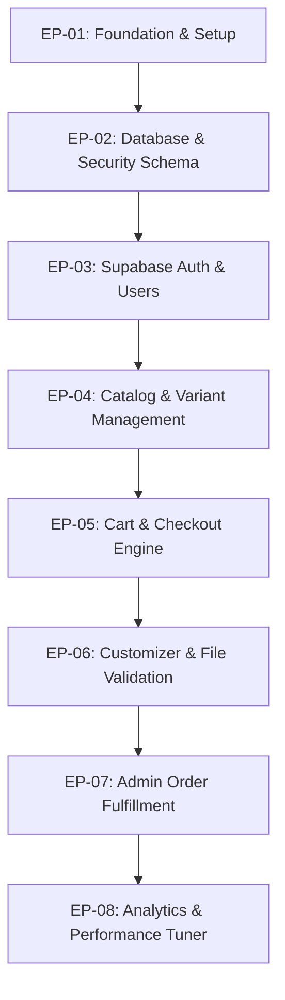

# Epic Registry & Product Backlog
## Papelería y Creaciones E&G — Sistema de Gestión y Roadmap del Producto

---

## 1. Filosofía de Gestión del Producto

Este proyecto se gestiona bajo una metodología **Lean-Agile iterativa**, priorizando el valor de negocio entregado al usuario final y reduciendo la complejidad del desarrollo (KISS - Keep It Simple, Stupid). El desarrollo se estructurará en Sprints semanales con lanzamientos continuos bajo integración y despliegue continuo (CI/CD).

### Convenciones de Gestión
*   **Historias de Usuario (US):** Describen la necesidad del cliente desde su perspectiva (`Como... Quiero... Para...`).
*   **Features (FT):** Funcionalidades de software específicas requeridas para resolver la historia de usuario.
*   **Epics (EP):** Grandes contenedores de funcionalidades que agrupan temas lógicos y módulos de arquitectura.

### Estados de Trabajo
`BACKLOG` ➔ `READY FOR DEV` ➔ `IN PROGRESS` ➔ `QA VALIDATION` ➔ `DONE`

### Versionado de Lanzamientos
Seguimos el estándar de **SemVer 2.0.0** (Semántica de Versiones):
*   `v1.0.0-alpha.x`: Pruebas de integración de backend y base de datos con interfaz cruda.
*   `v1.0.0-beta.x`: MVP utilizable por usuarios invitados para pruebas controladas.
*   `v1.0.0`: Lanzamiento a Producción con Core E-commerce.
*   `v1.x.y`: Incrementos menores de funcionalidades (ej. Cotizador interactivo, carga masiva).
*   `v2.x.y`: Lanzamientos mayores (ej. visualizadores 3D o integraciones B2B complejas).

---

## 2. Mapa de Dependencias y Ruta de Lanzamientos (Dependency Map)



*   **Desarrollo en paralelo posible:** La configuración de estilos y diseño del catálogo (`EP-04`) puede avanzar en paralelo con la lógica avanzada de autenticación y sesiones de cliente (`EP-03`) una vez definidos los mockups y el esquema de base de datos (`EP-02`).

---

## 3. Registro de Epics del Proyecto

---

### EP-01: Foundation & Project Setup
*   **Descripción:** Configuración e inicialización del repositorio de código, dependencias de frameworks y canalización de despliegue en Vercel.
*   **Objetivo:** Disponer de una base de código estable con TypeScript estricto, Tailwind v4 y directivas ESLint.
*   **Valor de Negocio:** Permite al equipo de ingeniería trabajar sobre estándares limpios y desplegar de forma segura a staging con cada Pull Request.
*   **Prioridad:** Alta (Bloqueante).
*   **Dependencias:** Ninguna.
*   **Entregables:** Repositorio en GitHub configurado, pipeline de despliegue a Vercel automatizado, configuración de variables de entorno globales.
*   **Riesgos:** Demoras por configuraciones iniciales de compatibilidad de Tailwind v4 y Next.js 15.
*   **Estado:** READY FOR DEV.
*   **Versión:** v1.0.0-alpha.1.
*   **KPIs:** Tiempo de carga inicial del scaffolding en Vercel inferior a 1 segundo.
*   **Criterios de Aceptación:** El comando `npm run build` debe compilar sin advertencias de ESLint ni fallos de TypeScript.

#### Feature Breakdown
*   **FT-1.1:** Setup de Next.js 15, TypeScript y alias de importaciones (`@/*`). (Alta / Complejidad: Baja / Impacto: Alto).
*   **FT-1.2:** Configuración de Tailwind CSS v4 y variables CSS globales de tipografía y color. (Alta / Complejidad: Baja / Impacto: Alto).
*   **FT-1.3:** Integración base de componentes de shadcn/ui. (Alta / Complejidad: Baja / Impacto: Medio).

---

### EP-02: Database & Security Schema (Supabase)
*   **Descripción:** Modelamiento de base de datos relacional y configuración de políticas de acceso a nivel de fila (RLS) en Supabase PostgreSQL.
*   **Objetivo:** Crear tablas, relaciones, triggers, e índices optimizados para catálogos y órdenes.
*   **Valor de Negocio:** Garantiza la integridad de la información fiscal y los archivos de diseño de los clientes, previniendo fugas de datos.
*   **Prioridad:** Alta.
*   **Dependencias:** EP-01.
*   **Entregables:** Script de inicialización SQL con tablas de usuarios, productos, variantes, carrito, órdenes y transacciones.
*   **Riesgos:** Cambios inesperados en la arquitectura de datos que exijan migraciones SQL complejas en fases posteriores.
*   **Estado:** READY FOR DEV.
*   **Versión:** v1.0.0-alpha.2.
*   **KPIs:** Latencia de consultas de base de datos inferior a 50ms para lecturas de catálogo.
*   **Criterios de Aceptación:** Todas las tablas de base de datos deben tener activadas políticas RLS. El acceso anónimo debe estar restringido a lecturas del catálogo de productos.

#### Feature Breakdown
*   **FT-2.1:** Script de base de datos: Tablas de `products`, `variants` e índices de búsqueda. (Alta / Complejidad: Media / Impacto: Alto).
*   **FT-2.2:** Script de transacciones: Tablas de `orders`, `order_items` y `shipping_details`. (Alta / Complejidad: Alta / Impacto: Alto).
*   **FT-2.3:** Configuración de buckets en Supabase Storage con políticas RLS de lectura y escritura. (Alta / Complejidad: Media / Impacto: Alto).

---

### EP-03: Supabase Authentication & Client Portal
*   **Descripción:** Sistema de registro, inicio de sesión y gestión de perfiles de clientes habituales y administradores.
*   **Objetivo:** Proveer una experiencia de login segura utilizando credenciales (email/password) y proveedores OAuth (Google).
*   **Valor de Negocio:** Aumenta la retención de clientes mediante el guardado automático de direcciones de despacho y diseños en su panel privado.
*   **Prioridad:** Alta.
*   **Dependencias:** EP-02.
*   **Entregables:** Páginas de Login, Registro, Recuperación de contraseña, y Perfil del Cliente.
*   **Riesgos:** Redireccionamiento erróneo del token de sesión tras validaciones de email en Next.js.
*   **Estado:** BACKLOG.
*   **Versión:** v1.0.0-alpha.3.
*   **KPIs:** Tasa de conversión de registro, porcentaje de recuperación exitosa de contraseña sin intervención humana.
*   **Criterios de Aceptación:** Un usuario no autenticado no puede acceder a `/mi-cuenta` ni modificar información del carrito de otro usuario.

#### User Stories
*   *Como* cliente registrado  
    *Quiero* iniciar sesión con mi cuenta de Google  
    *Para* no tener que recordar una contraseña adicional al momento de la compra.  
    *Criterio de Aceptación:* El flujo de OAuth de Google debe registrar al usuario automáticamente en Supabase y redirigirlo a la vista anterior a la compra en menos de 3 segundos.

---

### EP-04: Catalog & Variant Selector
*   **Descripción:** Catálogo interactivo de productos listos y personalizados con filtrados avanzados.
*   **Objetivo:** Desplegar los productos en una grilla responsiva, rápida y optimizada para SEO.
*   **Valor de Negocio:** Primer punto de contacto y conversión. Facilita que perfiles como Camila encuentren rápidamente lo que buscan.
*   **Prioridad:** Alta.
*   **Dependencias:** EP-02.
*   **Entregables:** Grid de catálogo, filtros de categoría, barra de búsqueda en tiempo real, ficha de detalle de producto y selector de variantes (color, tamaño, técnica).
*   **Riesgos:** Renderizado lento al tener cientos de imágenes de catálogo cargadas de manera simultánea.
*   **Estado:** BACKLOG.
*   **Versión:** v1.0.0-beta.1.
*   **KPIs:** Tiempo de renders iniciales, velocidad de filtrado inferior a 200ms.
*   **Criterios de Aceptación:** El selector de variantes debe actualizar dinámicamente el precio mostrado y la disponibilidad del stock en la interfaz.

#### User Stories
*   *Como* Nicolás (el Emprendedor)  
    *Quiero* filtrar productos por la categoría "Insumos para Pymes" y ordenar por precio unitario  
    *Para* calcular rápidamente mi margen de costos sin perder tiempo navegando.  
    *Criterio de Aceptación:* El filtrado y ordenamiento debe realizarse sin refrescar la página completa (uso de hooks de estado y parámetros de URL limpios para conservar SEO).

---

### EP-05: Cart & Checkout Engine (MVP Pay)
*   **Descripción:** Carrito de compras del lado del cliente sincronizado en base de datos y pasarela de pago chilena integrada.
*   **Objetivo:** Procesar las órdenes de manera rápida y cobrar de manera segura.
*   **Valor de Negocio:** Asegura la conversión transaccional y elimina la validación de depósitos bancarios de forma manual.
*   **Prioridad:** Alta.
*   **Dependencias:** EP-02, EP-04.
*   **Entregables:** Drawer del carrito, página de Checkout, cálculo automatizado de despacho por comuna (Chile), integración de API de Webpay / MercadoPago.
*   **Riesgos:** Falla del webhook de confirmación de pago de la pasarela, dejando órdenes marcadas como pendientes que ya fueron cobradas.
*   **Estado:** BACKLOG.
*   **Versión:** v1.0.0 (MVP Oficial).
*   **KPIs:** Tasa de abandono de checkout inferior a 30%, tiempo de transacción promedio inferior a 45 segundos.
*   **Criterios de Aceptación:** Tras una transacción exitosa, el sistema debe descontar stock, cambiar el estado del pedido a "Aprobado para Taller" y enviar el comprobante de compra por email.

#### Feature Breakdown
*   **FT-5.1:** Persistencia de carrito local sincronizada con cuenta de usuario. (Alta / Complejidad: Media / Impacto: Alto).
*   **FT-5.2:** Integración con API de transportes de Chile para cálculo de tarifas dinámicas en el Checkout. (Alta / Complejidad: Alta / Impacto: Alto).
*   **FT-5.3:** Módulo de pagos con Webpay Plus y MercadoPago a través de API segura. (Alta / Complejidad: Alta / Impacto: Alto).

---

### EP-06: Customizer & File Validation System
*   **Descripción:** Constructor visual para cargar imágenes, ingresar nombres e interactuar con plantillas de productos personalizados.
*   **Objetivo:** Permitir la personalización autogestionada limitando el ingreso de archivos no aptos para impresión.
*   **Valor de Negocio:** Reduce las devoluciones por errores del cliente y suprime la asistencia de diseño uno a uno.
*   **Prioridad:** Media-Alta.
*   **Dependencias:** EP-02, EP-04.
*   **Entregables:** Panel de personalización en la ficha del producto, validador de dimensiones en pixeles e imágenes transparentes, lector y procesador de archivos Excel (.xlsx) para nombres.
*   **Riesgos:** Fatiga de memoria del navegador en móviles al procesar imágenes pesadas en el canvas del cliente.
*   **Estado:** BACKLOG.
*   **Versión:** v1.1.0.
*   **KPIs:** Tasa de éxito del validador de archivos (menos de 2% de rechazo físico en taller).
*   **Criterios de Aceptación:** El cargador de archivos debe denegar archivos inferiores a 150 DPI para productos estándar y requerir formato transparente (PNG/PDF/AI) para líneas DTF UV.

#### User Stories
*   *Como* María Teresa (la Coordinadora)  
    *Quiero* subir un archivo Excel con la lista de nombres de graduación de mi curso  
    *Para* que el sistema asocie automáticamente cada nombre a un diploma individual sin tener que escribirlos uno a uno.  
    *Criterio de Aceptación:* El sistema debe leer el archivo `.xlsx`, listar los nombres en una grilla interactiva editable para previsualizar errores de tipeo y autogenerar las maquetas individuales en PDF para el taller.

---

### EP-07: Admin Dashboard & Order Fulfillment
*   **Descripción:** Panel de control privado para la gestión de productos, inventario y cambio de estados de pedidos en el taller.
*   **Objetivo:** Centralizar y optimizar la operativa interna de Papelería y Creaciones E&G.
*   **Valor de Negocio:** Automatiza la comunicación interna y acelera la producción de órdenes de 5 días a 48 horas.
*   **Prioridad:** Alta.
*   **Dependencias:** EP-02, EP-05.
*   **Entregables:** Dashboard administrativo, vista de lista de órdenes con filtros, actualizador de estados de pedido, generador de PDF de ficha de producción e impresión directa.
*   **Riesgos:** Acceso no autorizado a vistas de administración por fallas en las reglas de rol en Supabase Auth.
*   **Estado:** BACKLOG.
*   **Versión:** v1.0.0.
*   **KPIs:** Tiempo de despacho interno, tasa de satisfacción del operario del taller.
*   **Criterios de Aceptación:** Únicamente los perfiles con rol `admin` en la base de datos pueden visualizar o interactuar con las rutas `/admin/*`.

---

## 4. Clasificación y Priorización de Backlog (RICE Matrix)

Utilizamos el sistema RICE para priorizar el backlog del MVP y fases consecutivas de desarrollo:

$$\text{RICE Score} = \frac{\text{Reach} \times \text{Impact} \times \text{Confidence}}{\text{Effort}}$$

*   **Reach (Alcance):** Escala de 1 a 10 (10 = afecta a todos los usuarios; 2 = afecta a nichos específicos).
*   **Impact (Impacto):** 3 = Masivo, 2 = Alto, 1 = Medio, 0.5 = Bajo.
*   **Confidence (Confianza):** Porcentaje (100% = Alta confianza en estimación; 50% = Baja confianza).
*   **Effort (Esfuerzo):** Escala de 1 a 5 (5 = Máximo esfuerzo; 1 = Esfuerzo mínimo de desarrollo).

| ID | Feature / Epic | Reach | Impact | Confidence | Effort | RICE Score | Prioridad | Versión |
| :--- | :--- | :--- | :--- | :--- | :--- | :--- | :--- | :--- |
| **FT-5.3** | Pasarela de Pago Integrada | 10 | 3 | 100% | 3 | **10.0** | **Crítica** | v1.0 (MVP) |
| **FT-2.1** | Esquema de Catálogo e Índices SQL | 10 | 2 | 100% | 2 | **10.0** | **Crítica** | v1.0 (MVP) |
| **FT-1.2** | Setup Visual y Tailwind CSS v4 | 10 | 2 | 100% | 2 | **10.0** | **Crítica** | v1.0 (MVP) |
| **FT-6.2** | Validador Client-Side de Calidad de Imagen| 8 | 3 | 90% | 3 | **7.2** | **Alta** | v1.1.0 |
| **FT-6.3** | Parser de Listados Excel para Nombres | 4 | 2 | 90% | 2 | **3.6** | **Media** | v1.1.0 |
| **FT-8.2** | Bóveda de archivos del cliente (Cloud Vault)| 3 | 2 | 80% | 4 | **1.2** | **Baja** | v1.2.0 |

---

## 5. Dashboard Ejecutivo de Proyecto

*   **Total de EPICS:** 8 ( MVP + Fase 1 y 2 )
*   **Total de Features Identificadas:** 24
*   **Total de User Stories Proyectadas:** 36
*   **Estado General del Proyecto:** 0% (Fase 0 - Cimientos y Planificación)

### Estado General del Desarrollo
```text
[▒▒▒▒▒▒▒▒▒▒▒▒▒▒▒▒▒▒▒▒] 0% Completado
```

### Próximos Pasos (Sprint 1)
1.  Aprobación de la estructura del Epic Registry.
2.  Setup del entorno inicial en GitHub y Vercel (`EP-01`).
3.  Migración y modelado de datos iniciales en Supabase (`EP-02`).
