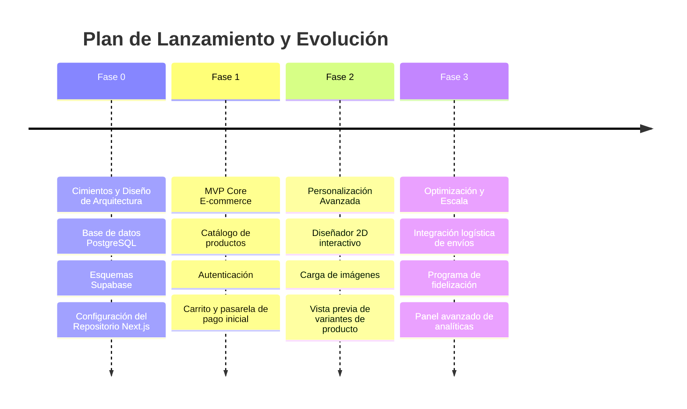
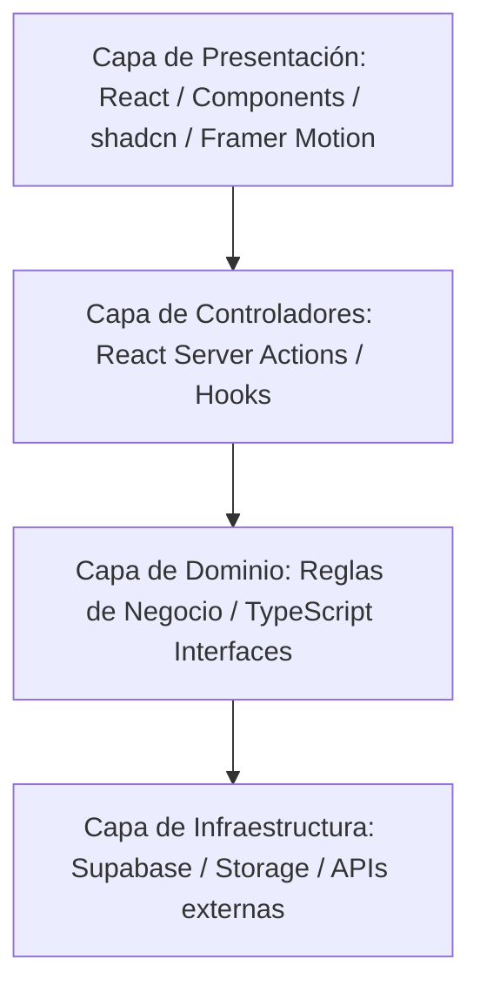

# Papelería y Creaciones E&G — Project Bible
## Fuente Oficial de la Plataforma y Activo Digital

---

## 1. Visión del Proyecto
**Papelería y Creaciones E&G** no es simplemente un e-commerce o un catálogo digital. Es un **activo digital empresarial** de alto rendimiento diseñado para transformar la forma en que los usuarios adquieren productos de papelería, manualidades, regalos y creaciones personalizadas. La plataforma está concebida como un ecosistema interactivo que une la practicidad de la compra rápida con la personalización detallada de artículos bajo demanda, permitiendo a los clientes materializar ideas en productos físicos mediante una experiencia digital de primer nivel.

---

## 2. Filosofía del Proyecto
> "No estamos construyendo una página web. Estamos construyendo un activo digital para una empresa."

Toda decisión técnica, de diseño, de arquitectura o de negocio se rige bajo los siguientes pilares:
*   **Performance y Core Web Vitals en Verde:** Un milisegundo de retraso es pérdida de conversión. La aplicación debe ser instantánea.
*   **Clean Architecture:** Separación clara de responsabilidades. La lógica de negocio no debe depender de los detalles de implementación (como la base de datos o el proveedor de autenticación).
*   **Mantenibilidad y Escalabilidad:** Código modular y tipado estricto que permita a nuevos desarrolladores integrarse y desplegar nuevas funcionalidades de manera fluida y sin regresiones.
*   **Accesibilidad y UX Inclusiva:** Cumplimiento de estándares WCAG para garantizar que cualquier persona pueda navegar, interactuar y comprar sin barreras.

---

## 3. Objetivos
### Objetivos de Negocio
*   **Posicionamiento de Marca:** Convertir a Papelería y Creaciones E&G en el referente digital de regalos y papelería personalizada en su región operativa.
*   **Optimización del Embudo de Ventas:** Lograr una tasa de conversión superior al 3.5% en visitas recurrentes.
*   **Eficiencia Operativa:** Automatizar la recepción de pedidos personalizados mediante flujos interactivos, reduciendo en un 70% las consultas manuales por canales informales (WhatsApp/Instagram).

### Objetivos Técnicos
*   **Velocidad de Carga:** Tiempo de interacción (TTI) inferior a 1.5 segundos en dispositivos móviles de gama media.
*   **Disponibilidad:** Arquitectura serverless y perfiles globales (Vercel + Supabase) para garantizar un uptime del 99.9%.
*   **Escalabilidad Estructural:** Cero acoplamiento rígido de base de datos para facilitar integraciones futuras con ERPs o plataformas de logística de terceros.

---

## 4. Misión
Facilitar la expresión de emociones, la organización diaria y la materialización de ideas creativas a través de productos de papelería de alta calidad y creaciones personalizadas a medida, ofreciendo una experiencia digital intuitiva, ágil y visualmente atractiva que inspire confianza y deleite en cada interacción.

---

## 5. Visión
Convertirse para el 2030 en la plataforma omnicanal líder en soluciones creativas y papelería personalizada del mercado hispanohablante, reconocida por su excelencia en diseño, facilidad de personalización digital y un sistema de distribución rápido y confiable.

---

## 6. Público Objetivo
La plataforma atiende a tres perfiles clave de usuarios finales:

| Arquetipo | Necesidades Principales | Canales y Dispositivos |
| :--- | :--- | :--- |
| **Estudiantes y Entusiastas de la Papelería** | Organización, estética, bolígrafos, cuadernos de diseño, planners, stickers. | Mobile First (Instagram/TikTok redirection), tablets. |
| **Buscadores de Regalos Personalizados** | Regalos únicos para fechas especiales (aniversarios, cumpleaños), empaques exclusivos. | Mobile y Desktop, compras rápidas de último minuto. |
| **Empresas y Profesionales (B2B)** | Papelería corporativa, regalos empresariales en volumen, agendas personalizadas con branding. | Principalmente Desktop, cotizaciones rápidas, facturación interactiva. |

---

## 7. Propuesta de Valor
**"Detalles que Inspiran, Creaciones que Conectan"**
Ofrecemos un catálogo curado de productos listos para enviar junto con un potente e intuitivo configurador de personalización en tiempo real. Eliminamos la incertidumbre de la compra personalizada permitiendo al usuario previsualizar su producto, elegir materiales y colores, y calcular costos exactos al instante, con la garantía de una entrega impecable.

---

## 8. Valores
*   **Calidad de Producto y Software:** Obsesión por el detalle, tanto en el papel seleccionado como en el código fuente escrito.
*   **Transparencia:** Costos claros y tiempos de entrega reales sin tarifas ocultas.
*   **Diseño Centrado en el Humano:** Todo flujo digital debe minimizar la fricción cognitiva del usuario.
*   **Innovación Continuua:** Adopción temprana de tecnologías que aporten valor real al cliente final.

---

## 9. Diferenciadores
1.  **Configurador de Personalización Guiado:** Un flujo paso a paso sin fricciones que sustituye los extensos formularios estáticos por decisiones visuales fluidas.
2.  **Carga Instantánea:** Optimización extrema de assets (imágenes en formatos modernos, fuentes autocontenidas) y pre-renderizado estático dinámico.
3.  **Arquitectura Fluida (Framer Motion):** Transiciones fluidas entre vistas y feedback visual inmediato ante cada interacción del usuario.

---

## 10. Modelo de Negocio
*   **Venta Directa B2C (E-commerce Tradicional):** Productos listos para usar con procesamiento de pagos inmediato.
*   **Creaciones Personalizadas bajo Demanda (Custom Orders):** Cobro por nivel de personalización y materiales seleccionados en el configurador.
*   **Lotes Corporativos (B2B):** Presupuestos dinámicos basados en volumen para empresas que requieren artículos personalizados para eventos u oficina.

---

## 11. Alcance del MVP
El Producto Mínimo Viable se enfocará en habilitar la compra de productos estándar y la personalización básica guiada:

*   **Autenticación de Usuarios:** Registro, inicio de sesión y recuperación de contraseña a través de Supabase Auth (Email/Password y Google).
*   **Catálogo de Productos:** Grid responsiva con filtrado avanzado y paginación ultrarrápida.
*   **Módulo de Detalle de Producto:** Soporte para imágenes múltiples, descripción enriquecida, stock en tiempo real y selector de variantes (color, tamaño).
*   **Carrito de Compras Persistente:** Manejo en estado local sincronizado con Supabase para usuarios registrados.
*   **Checkout Simplificado:** Integración con pasarela de pago y recolección de datos de envío detallados.
*   **Panel de Usuario:** Historial de compras, estado del pedido en tiempo real y libreta de direcciones.
*   **Panel de Administración (Backoffice básico):** Gestión de inventario, cambio de estados de pedidos y visualización de especificaciones de personalización.

---

## 12. Roadmap del Proyecto



---

## 13. Arquitectura General
El sistema implementa una **Arquitectura en Capas Limpia (Clean Architecture)** adaptada a Next.js (App Router).



### Principios de Organización:
*   **domain:** Interfaces puras de TypeScript que modelan las entidades (ej. `Product`, `Order`, `User`). No contienen dependencias de librerías ni de Supabase.
*   **infrastructure:** Adaptadores de bases de datos, clientes de servicios externos y llamadas HTTP directas a Supabase.
*   **presentation:** Páginas del App Router (`app/`), componentes UI atómicos (`components/ui/`), y componentes de negocio organizados bajo `/features`.

---

## 14. Stack Tecnológico

| Componente | Tecnología | Razón de Elección |
| :--- | :--- | :--- |
| **Framework Web** | Next.js 15 (App Router) | Soporte nativo para Server Components, Server Actions, y excelente SEO out-of-the-box. |
| **Librería UI** | React 19 | Estándar de la industria, ecosistema masivo, manejo eficiente de estados transicionales. |
| **Estilos** | Tailwind CSS v4 | Compilador ultrarrápido por defecto, CSS-in-JS moderno sin sobrecarga de runtime. |
| **Componentes Base** | shadcn/ui | Componentes accesibles (Radix UI) que no imponen estilos restrictivos, permitiendo personalización total. |
| **Animaciones** | Framer Motion | Animaciones fluidas, declarativas e interacciones complejas de gran fidelidad visual. |
| **Base de Datos** | PostgreSQL (Supabase) | Base de datos relacional de grado empresarial, soporte robusto para consultas complejas. |
| **Autenticación** | Supabase Auth | Seguridad e integración nativa con políticas a nivel de fila (RLS). |
| **Almacenamiento** | Supabase Storage | Excelente CDN integrado para imágenes optimizadas de catálogo. |
| **Hosting y Despliegue**| Vercel | Integración nativa con Next.js, despliegues automáticos por rama y CDN global de alto rendimiento. |

---

## 15. Estándares de Desarrollo
Para asegurar un código limpio, legible y escalable, se seguirán estrictamente las siguientes reglas:
*   **TypeScript Estricto:** Prohibido el uso de `any`. Toda propiedad externa debe venir tipada o validada a través de schemas (Zod).
*   **Componentes Puros y Reactivos:** Los componentes visuales deben ser lo más puros posibles. La lógica compleja se extrae a *hooks personalizados*.
*   **React Server Components por Defecto:** Todo componente se asume del lado del servidor (RSC) a menos que requiera interactividad (eventos, hooks de estado), en cuyo caso se usará `'use client'`.
*   **Control de Errores Riguroso:** Cada llamada a una API o servicio externo debe estar envuelta en bloques estructurados que capturen excepciones y muestren estados de error amigables al usuario (usando `ErrorBoundary` y componentes de fallback).

---

## 16. Convenciones del Proyecto
### Estructura de Directorios (Propuesta)
```text
/
├── app/                  # Directorio del Next.js App Router (Rutas y Páginas)
├── components/           # Componentes compartidos de la plataforma
│   ├── ui/               # Componentes atómicos de presentación (shadcn/ui modificados)
│   └── layout/           # Componentes estructurales (Navbar, Footer, Sidebar)
├── features/             # Módulos encapsulados por lógica de negocio
│   ├── catalog/          # Componentes, hooks y tipos específicos del catálogo
│   ├── checkout/         # Lógica y flujos del carrito y pago
│   └── customization/    # El núcleo del configurador interactivo
├── lib/                  # Utilidades compartidas y clientes de APIs
│   ├── supabase/         # Configuración del cliente Supabase (Server / Client)
│   └── utils.ts          # Funciones helper generales
└── docs/                 # Documentación técnica e institucional del proyecto
```

### Convención de Nombres
*   **Componentes de React:** PascalCase (ej. `ProductCard.tsx`, `CartSummary.tsx`).
*   **Archivos Auxiliares/Hooks:** camelCase (ej. `useCart.ts`, `formatCurrency.ts`).
*   **Estilos y Clases CSS:** Nombres descriptivos organizados lógicamente de mayor a menor jerarquía estructural (layout -> espaciado -> tipografía -> colores -> efectos).

### Convención de Commits (Conventional Commits)
Los mensajes de confirmación en Git deben seguir la estructura: `<tipo>(<ámbito>): <descripción>`
*   `feat`: Nueva funcionalidad.
*   `fix`: Corrección de un error.
*   `docs`: Cambios en la documentación.
*   `style`: Cambios estéticos o de formato que no afectan la lógica.
*   `refactor`: Reestructuración de código sin alterar su comportamiento.
*   `perf`: Mejoras de rendimiento del sistema.

---

## 17. Principios de UX (Experiencia de Usuario)
*   **Minimizar la Carga Cognitiva:** Limitar el número de decisiones por pantalla. En procesos lineales como checkout o personalización, usar un flujo paso a paso claro.
*   **Optimismo en la UI (Optimistic Updates):** Acciones como añadir al carrito o dar "like" a un producto favorito deben reflejarse visualmente al instante mientras la solicitud se procesa de fondo.
*   **Feedback Inmediato:** Cada interacción del usuario (click, hover, envío de formulario) debe contar con una respuesta visual o de transición clara para evitar clics repetitivos.
*   **Mobile-First Dinámico:** La interfaz debe ser completamente funcional e intuitiva en pantallas táctiles pequeñas antes de escalar a pantallas grandes.

---

## 18. Principios de UI (Diseño de Interfaz)
*   **Tipografía Moderna y Legible:** Uso de fuentes optimizadas para lectura web (ej. `Geist` o `Inter` combinadas con una tipografía con serif elegante para títulos si el branding lo requiere).
*   **Paleta de Colores Sofisticada:** Colores HSL curados. Evitar tonos puros extremos; utilizar una escala balanceada de grises y acentos cálidos inspirados en el papel y la tinta.
*   **Consistencia de Espaciados:** Implementación estricta de una escala base de 4px/8px para márgenes y paddings, previniendo interfaces visualmente desorganizadas.
*   **Soporte de Tema Oscuro Nativo:** Diseñado desde el inicio utilizando variables CSS de Tailwind para una transición fluida entre temas claro y oscuro.

---

## 19. Definición de Éxito
El éxito del proyecto al finalizar el desarrollo se medirá a través de:
1.  **Puntajes Lighthouse / Core Web Vitals:** Rendimiento > 90, Accesibilidad > 95, SEO > 98 en todas las páginas clave del sitio.
2.  **Facilidad de Mantenimiento:** Cobertura de pruebas unitarias en funciones de negocio y cero errores de TypeScript en producción.
3.  **Tasa de Retención de Clientes:** Fluidez en el flujo de compra y personalización que fomente visitas y pedidos recurrentes.

---

## 20. Futuras Expansiones (Post-MVP)
*   **Visualizador 3D Interactivo:** Integración de Three.js para previsualizar productos personalizados con relieve y texturas reales en tres dimensiones.
*   **Sistema de Suscripciones Mensuales:** Planes recurrentes de "Cajas Creativas" y Kits de Organización para entusiastas del bullet journaling.
*   **Inteligencia Artificial para Asistencia Creativa:** Asistente de IA para sugerencias de combinación de colores y redacción de textos para tarjetas de regalo personalizadas.
*   **Integración Multitienda / Omnicanal:** Sincronización del inventario del e-commerce con puntos de venta físicos y marketplaces de terceros.
