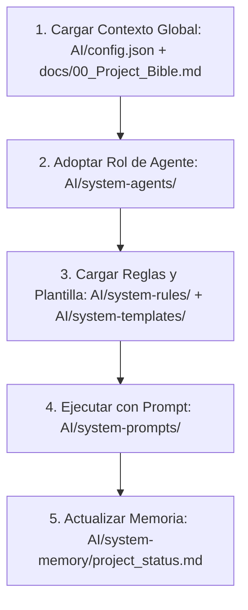

# AI Development System (AIDS) — Architecture & Blueprint
## Sistema de Desarrollo Asistido por Inteligencia Artificial

---

## 1. Estructura de Directorios del Sistema `AI`

Para convertir el directorio `AI/` en el cerebro del proyecto y permitir que cualquier LLM u agente autónomo opere con contexto perfecto, se establece el siguiente árbol de directorios y archivos:

```text
AI/
├── config.json                     # Configuración global del sistema de IA y metadatos del proyecto
├── system-agents/                  # Contextos específicos para cada rol de agente
│   ├── 01_software_architect.md
│   ├── 02_product_manager.md
│   ├── 03_ux_designer.md
│   ├── 04_ui_designer.md
│   ├── 05_frontend_engineer.md
│   ├── 06_backend_engineer.md
│   ├── 07_database_engineer.md
│   ├── 08_devops_engineer.md
│   ├── 09_qa_engineer.md
│   ├── 10_seo_specialist.md
│   ├── 11_performance_engineer.md
│   ├── 12_security_engineer.md
│   ├── 13_technical_writer.md
│   ├── 14_marketing_strategist.md
│   └── 15_content_creator.md
├── system-rules/                   # Reglas estrictas y principios permanentes
│   ├── naming_conventions.md
│   ├── git_flow.md
│   ├── clean_code_solid.md
│   ├── security_standards.md
│   ├── accessibility_wcag.md
│   ├── responsive_design.md
│   ├── performance_budgets.md
│   ├── seo_practices.md
│   ├── typescript_standards.md
│   ├── react_nextjs_rules.md
│   └── supabase_policies.md
├── system-templates/                # Plantillas reutilizables estructuradas
│   ├── page_template.tsx
│   ├── component_template.tsx
│   ├── api_route_template.ts
│   ├── migration_template.sql
│   ├── use_case_template.md
│   ├── user_story_template.md
│   ├── pull_request_template.md
│   ├── issue_template.md
│   └── adr_template.md
├── system-prompts/                 # Biblioteca modular de prompts de ejecución
│   ├── code-generation/
│   │   ├── create_component.md
│   │   ├── create_api.md
│   │   ├── create_page.md
│   │   └── create_migration.md
│   ├── quality-assurance/
│   │   ├── code_refactor.md
│   │   ├── create_tests.md
│   │   ├── review_architecture.md
│   │   └── review_security.md
│   └── optimization/
│       ├── optimize_seo.md
│       ├── optimize_performance.md
│       └── optimize_accessibility.md
├── system-context/                 # Base de conocimientos compartida y desacoplada
│   ├── business_model.md
│   ├── product_vision.md
│   ├── product_roadmap.md
│   ├── branding_guidelines.md
│   ├── ux_flows.md
│   ├── database_schema.md
│   └── architecture_decisions.md
└── system-memory/                  # Registro de estado, decisiones y memoria de largo plazo
    ├── adr_log/                    # Historial de Architecture Decision Records
    ├── incident_log.md             # Problemas críticos resueltos y lecciones aprendidas
    ├── patterns_used.md            # Catálogo de patrones de diseño implementados
    ├── active_dependencies.md      # Registro y justificación de paquetes npm/Supabase
    └── project_status.md           # Estado actual de tareas y features pendientes
```

---

## 2. Explicación de cada Carpeta

### `AI/system-agents/`
Contiene los archivos de definición de contexto de cada agente especializado. Cada archivo contiene la definición del rol, su alcance de acción (qué archivos puede tocar), qué tecnologías domina, y qué restricciones tiene para no interferir en el dominio de otros agentes.

### `AI/system-rules/`
Establece las directrices y estándares no negociables del proyecto. Los agentes deben leer estas reglas antes de generar código para asegurar consistencia en la nomenclatura, convenciones de Git, tipado en TypeScript, y directrices de seguridad y accesibilidad.

### `AI/system-templates/`
Colección de blueprints listos para copiar y rellenar. Asegura que la arquitectura de archivos (ej. un Componente de React o una Migración de base de datos) mantenga la misma firma estructural, estructura de importaciones y manejo de tipos.

### `AI/system-prompts/`
Directivas de ejecución específicas para tareas comunes. Están estructurados bajo el estándar de ingeniería de prompts más avanzado (Role-Context-Task-Constraint-Output) para asegurar que la IA genere el resultado óptimo en un solo intento.

### `AI/system-context/`
El repositorio estático de la verdad del negocio y diseño. Desacopla la lógica de negocio y las decisiones estéticas de la base de código del software, permitiendo que la IA comprenda la identidad y objetivos de la empresa antes de programar.

### `AI/system-memory/`
La memoria de largo plazo y el registro de estado del proyecto. Evita el "olvido de contexto" y el "desvío arquitectónico" donde la IA podría sugerir cambios incompatibles con decisiones de diseño tomadas previamente en el proyecto.

---

## 3. Explicación y Estructura de los Archivos Clave

### A. Los Agentes (`system-agents/`)
Cada agente se rige por un documento markdown estandarizado que delimita sus capacidades:

1.  **Software Architect:**
    *   *Responsabilidad:* Definir la arquitectura general, validar patrones de diseño y aprobar modificaciones en `AI/system-context/architecture_decisions.md`.
    *   *Qué puede modificar:* Configuración del framework, arquitecturas de carpetas, esquemas globales de datos.
    *   *Qué nunca debe modificar:* Contenido de branding estético o copys finales sin autorización del UX/UI o Product Manager.
    *   *Interacciones:* Trabaja de la mano con el Database Engineer y Frontend/Backend Engineers para validar que la implementación coincida con la arquitectura aprobada.
2.  **Product Manager:**
    *   *Responsabilidad:* Mantener el alcance del MVP, priorizar requerimientos en el Roadmap y validar historias de usuario.
    *   *Qué puede modificar:* `roadmap.md`, `project_status.md`, `user_story_template.md`.
    *   *Qué nunca debe modificar:* Código fuente, consultas SQL directas o configuraciones de despliegue.
3.  **UX Designer:**
    *   *Responsabilidad:* Diseñar flujos de navegación lógicos, diagramar interacciones y flujos de usuario (User Journeys).
    *   *Qué puede modificar:* `ux_flows.md` y guías de usabilidad.
    *   *Qué nunca debe modificar:* Backend, APIs, o políticas RLS en Supabase.
4.  **UI Designer:**
    *   *Responsabilidad:* Mantener la coherencia visual, tokens de diseño de Tailwind, y biblioteca de componentes de shadcn.
    *   *Qué puede modificar:* `branding_guidelines.md`, variables globales CSS de Tailwind.
    *   *Qué nunca debe modificar:* Lógica de base de datos o lógica de negocio en el Backend.
5.  **Frontend Engineer:**
    *   *Responsabilidad:* Implementación de la UI, animaciones en Framer Motion e interacción en el App Router.
    *   *Qué puede modificar:* Directorios `/app`, `/components`, `/features`.
    *   *Qué nunca debe modificar:* Políticas de seguridad de Supabase de manera directa (debe requerir al Security/Database Engineer).
6.  **Backend Engineer:**
    *   *Responsabilidad:* Server Actions de Next.js, integraciones externas y lógica de negocio.
    *   *Qué puede modificar:* Controladores, integraciones de APIs y llamadas a servicios.
    *   *Qué nunca debe modificar:* Clases CSS globales o animaciones visuales de la interfaz de usuario.
7.  **Database Engineer:**
    *   *Responsabilidad:* Estructura de PostgreSQL, índices, triggers y funciones SQL en Supabase.
    *   *Qué puede modificar:* Archivos SQL de migración y `database_schema.md`.
    *   *Qué nunca debe modificar:* Estilos CSS de las interfaces o lógica frontend pura.
8.  **DevOps Engineer:**
    *   *Responsabilidad:* Pipelines de CI/CD en GitHub Actions y despliegues en Vercel.
    *   *Qué puede modificar:* Archivos de configuración de GitHub, Webhooks e infraestructura Serverless.
9.  **QA Engineer:**
    *   *Responsabilidad:* Escribir y ejecutar pruebas unitarias, de integración y end-to-end (E2E).
    *   *Qué puede modificar:* Directorios `/tests`, `vitest.config.ts`, `playwright.config.ts`.
10. **SEO Specialist:**
    *   *Responsabilidad:* Meta tags, sitemaps, JSON-LD estructurado y optimización de carga para motores de búsqueda.
    *   *Qué puede modificar:* Metadatos de páginas y configuración de Next-Sitemap.
11. **Performance Engineer:**
    *   *Responsabilidad:* Análisis de bundle-size, optimización de renderizados en React y Core Web Vitals.
    *   *Qué puede modificar:* Configuraciones de imágenes, lazy loading y Web Workers.
12. **Security Engineer:**
    *   *Responsabilidad:* Validación de políticas Row Level Security (RLS) en Supabase, sanitización de datos y Headers de seguridad.
    *   *Qué puede modificar:* Políticas de base de datos y configuraciones de middleware de seguridad.
13. **Technical Writer:**
    *   *Responsabilidad:* Documentación técnica del código, mantenimiento de la Project Bible y el sistema AI.
    *   *Qué puede modificar:* Todos los documentos en `/docs` y `/AI`.
14. **Marketing Strategist:**
    *   *Responsabilidad:* Definir la estrategia de embudo y analizar copys publicitarios y de landing page.
    *   *Qué puede modificar:* Copys y textos persuasivos en assets de marketing.
15. **Content Creator:**
    *   *Responsabilidad:* Textos e imágenes finales del catálogo y publicaciones del blog integrado.
    *   *Qué puede modificar:* Archivos MDX de contenido y assets del catálogo.

### B. El Sistema de Contexto (`system-context/`)
Mantiene la información unificada e independiente de la implementación técnica:
*   `business_model.md`: Estructura de monetización, comisiones de personalización y costos de envío.
*   `database_schema.md`: Representación conceptual del modelo de datos ER (Entidad-Relación) y reglas de negocio para transacciones.
*   `branding_guidelines.md`: Paleta de colores HSL oficial, pesos tipográficos, tokens de espaciado y animaciones aprobadas.

### C. El Sistema de Prompts (`system-prompts/`)
Organizado de forma modular por acción técnica:
*   `create_component.md`: Prompt estructurado que obliga a la IA a verificar la accesibilidad, exportaciones puras, no duplicar componentes de shadcn y escribir pruebas unitarias correspondientes.
*   `optimize_seo.md`: Instrucciones para inyectar schemas de JSON-LD y optimizar metadatos dinámicos basados en la ruta.
*   `review_security.md`: Prompt que analiza Server Actions para detectar inyecciones SQL o fugas de IDs sensibles en las payloads.

### D. El Sistema de Reglas (`system-rules/`)
Los límites definitivos del desarrollo:
*   `naming_conventions.md`: Reglas exactas para nombres de archivos, componentes, variables CSS y tablas SQL.
*   `git_flow.md`: Convenciones de ramas (`feat/`, `fix/`, `chore/`), estructura del Pull Request y políticas de merge.
*   `clean_code_solid.md`: Guía de refactorización activa para prevenir que la IA acumule lógica en un solo componente o archivo.

### E. El Sistema de Plantillas (`system-templates/`)
Formatos estandarizados en formato de código real:
*   `component_template.tsx`: Ejemplo con TypeScript estricto, imports ordenados, uso de Tailwind v4 y exports limpios.
*   `adr_template.md`: Plantilla Architecture Decision Record para documentar el "por qué" de las elecciones técnicas.

---

## 4. Flujo de Trabajo Recomendado (Workflow de la IA)

Para garantizar que el sistema de IA funcione con la máxima precisión, se recomienda el siguiente flujo de interacción estructurado en 4 pasos:



1.  **Contextualización Inicial:** La IA lee la Project Bible y el `AI/config.json` para entender el alcance global.
2.  **Asignación de Rol:** El usuario o el sistema inicializa a la IA indicándole que cargue el agente correspondiente (ej: `01_software_architect.md` si se está diseñando un nuevo módulo).
3.  **Carga de Constraints (Reglas):** Se le indica a la IA que lea la regla específica de la tarea en curso (ej: `react_nextjs_rules.md`).
4.  **Generación y Registro de Memoria:** Tras completar la tarea, la IA actualiza el archivo `project_status.md` y/o registra un ADR en `system-memory/adr_log/` si tomó una decisión de diseño crítica.

---

## 5. Convenciones Generales del AIDS

*   **Identificación Única de Documentos:** Todos los documentos del sistema de IA deben poseer un ID de cabecera único (ej: `ID: AIDS-AGENT-ARCHITECT`) para facilitar referencias cruzadas rápidas.
*   **Enlace de Dependencias:** Si un archivo depende de otro (ej. el agente Database Engineer depende del esquema conceptual `AI/system-context/database_schema.md`), se debe listar explícitamente en el encabezado del archivo.
*   **Actualización Obligatoria de Memoria:** Ningún cambio de base de datos o lógica compleja puede darse por finalizado sin actualizar la sección correspondiente en `AI/system-memory/`.

---

## 6. Buenas Prácticas de Mantenimiento del Sistema

*   **Revisiones Periódicas:** Al final de cada fase del Roadmap (ver `docs/00_Project_Bible.md`), el arquitecto humano debe revisar las decisiones documentadas en la carpeta `system-memory/` para consolidar y refinar las reglas del sistema.
*   **Versionamiento Estricto:** Toda modificación en el directorio `AI/` debe pasar por control de versiones (Git) y ser revisada como si fuera código de producción de la aplicación.
*   **Simplicidad ante Todo:** Si una regla o plantilla deja de ser relevante debido a actualizaciones en Tailwind v4 o Next.js 15, debe eliminarse inmediatamente para evitar sobrecargar la ventana de contexto de la IA.

---

## 7. Recomendaciones Futuras

*   **Automatización de Contexto:** A medida que el proyecto crezca, se pueden usar herramientas de CLI personalizadas para compilar automáticamente el directorio `AI/` y presentárselo a la IA de manera estructurada en un solo prompt consolidado.
*   **Integración con GitHub Actions:** Crear un paso de CI que verifique si el código entregado cumple rigurosamente con las reglas estipuladas en `AI/system-rules/` antes de permitir el merge.
