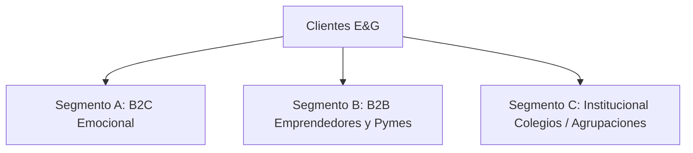
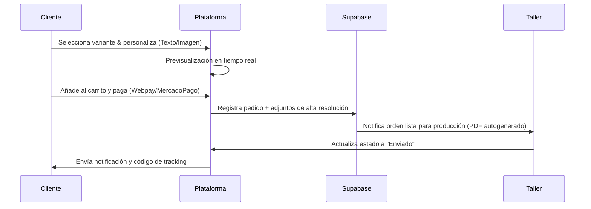

# Estrategia de Negocio y Modelo de Operaciones
## Papelería y Creaciones E&G — Activo Digital y Modelo de Negocio

---

## 1. Quién es la Empresa e Historia
**Papelería y Creaciones E&G** es una empresa chilena que nació en el mercado local con el propósito de transformar ideas y sentimientos en productos tangibles de alta calidad. Fundada originalmente como un taller familiar de manualidades y papelería a medida, la empresa identificó rápidamente la necesidad de los clientes de buscar obsequios e identidades corporativas con un valor añadido: la personalización. 

Hoy, la marca atiende tanto a consumidores finales (B2C) en busca de detalles significativos, como a microempresarios y colegios (B2B) que requieren soluciones de marca rápidas y de bajo volumen sin las barreras de pedido mínimo impuestas por las imprentas industriales tradicionales.

---

## 2. Qué Vende Realmente (La Esencia del Negocio)
La empresa **no vende productos físicos genéricos**; vende **soluciones emocionales y de identidad visual**. 

*   **En la línea de Regalos y Álbumes:** No se vende papel o cartón; se venden **recuerdos preservados** y emociones tangibles.
*   **En la línea de Corporativos y Emprendedores:** No se venden stickers o etiquetas; se vende **profesionalismo, credibilidad e identidad de marca** para que un negocio emergente compita visualmente con grandes corporaciones.
*   **En la línea escolar:** No se venden cuadernos o diplomas; se vende **reconocimiento y motivación** para el logro de los estudiantes.

---

## 3. Problemas que Resuelve
1.  **Complejidad en la Personalización:** Comprar un producto personalizado suele requerir múltiples correos, envío de archivos por WhatsApp y malentendidos sobre el diseño final.
2.  **Falta de Acceso a Diseños Profesionales en Pequeña Escala:** Las imprentas tradicionales exigen mínimos de producción (ej. 1,000 etiquetas). E&G permite la producción flexible.
3.  **Incertidumbre en el Resultado:** El cliente teme que el producto final no coincida con su idea visual.
4.  **Procesos de Compra Lentos:** La cotización manual genera retrasos de hasta 48 horas en responder un mensaje de WhatsApp.

---

## 4. Público Objetivo y Segmentos de Clientes

### Segmento A: B2C Emocional (El Detallista)
*   **Perfil:** Hombres y mujeres de 18 a 45 años. Buscan regalos significativos y personalizados para fechas especiales.
*   **Customer Jobs:** Expresar afecto a través de un regalo único, organizar su vida académica/personal con estilo.
*   **Pain Points:** Falta de tiempo para idear regalos, miedo a que el regalo se vea barato o impersonal, retrasos en entregas.
*   **Gains:** Orgullo de regalar algo único, satisfacción estética (Bullet Journaling / Agendas).

### Segmento B: B2B Emprendedores y PyMEs (El Profesionalizador)
*   **Perfil:** Creadores de marcas de moda, repostería artesanal, cosmética natural, etc., que requieren packaging profesional.
*   **Customer Jobs:** Elevar la presentación de sus envíos, etiquetar sus productos cumpliendo normas estéticas, generar un unboxing memorable.
*   **Pain Points:** Precios prohibitivos de imprentas grandes, mala calidad de stickers que se despegan, lentitud en el diseño de prototipos.
*   **Gains:** Aumento percibido del valor de su marca, recompra de sus propios clientes debido al empaque.

### Segmento C: B2B2C Colegios e Instituciones (El Organizador de Eventos)
*   **Perfil:** Centros de padres, profesores y directores de colegios o academias.
*   **Customer Jobs:** Organizar graduaciones, premiaciones, eventos escolares y regalos de fin de año de forma masiva pero personalizada.
*   **Pain Points:** Coordinar pedidos de 50 o 100 alumnos con nombres distintos sin cometer errores ortográficos en los diplomas o tazas.
*   **Gains:** Ejecución impecable del evento, reconocimiento positivo por parte de la comunidad escolar.

---

## 5. Propuesta de Valor

| Para quién | Qué ofrecemos | Beneficio principal |
| :--- | :--- | :--- |
| **B2C Emocional** | Plataforma interactiva de regalos personalizables con previsualización en tiempo real. | Certeza visual de lo que se va a recibir y entrega rápida sin estrés. |
| **B2B Emprendedores** | Packs de branding flexibles (etiquetas, stickers en DTF UV, merchandising) sin mínimos industriales. | Professionalización acelerada de marca con inversión accesible. |
| **Instituciones** | Herramientas de carga masiva de nombres/diseños con plantillas de validación integradas. | Cero errores de transcripción y presupuestos inmediatos por volumen. |

---

## 6. Canales de Adquisición
1.  **Redes Sociales (Adquisición Orgánica y Paga):**
    *   *Instagram:* Mostrar el resultado final de los productos (unboxing y videos de procesos reales).
    *   *TikTok:* Explicación de técnicas como DTF UV y sublimación paso a paso para educar al consumidor B2B.
2.  **WhatsApp Business:** Canal preferente de cierre y soporte técnico que pasará de ser el punto de entrada a ser un canal de fidelización y notificaciones del estado del pedido.
3.  **SEO Local y de Nicho:** Posicionamiento orgánico en búsquedas de nicho como *"regalos personalizados Santiago"* o *"etiquetas DTF UV personalizadas Chile"*.

---

## 7. Flujo de Ventas: Actual vs. Futuro

### Flujo Actual (100% Manual y Saturado)
1.  El cliente ve un reel en Instagram e inicia chat.
2.  Se redirige a WhatsApp.
3.  El equipo de E&G responde pidiendo referencias de diseño (demora de 1 a 6 horas).
4.  El cliente envía imágenes de baja calidad por WhatsApp.
5.  Intercambio de datos para transferencia bancaria.
6.  Validación manual del comprobante de transferencia.
7.  El diseñador realiza la maqueta y la envía al cliente para aprobación.
8.  Aprobación tardía y paso a producción. **(Fricción y pérdida de conversión en cada paso)**.

### Flujo Futuro (Automatizado y Eficiente)

---

## 8. Procesos de Negocio a Automatizar vs. Manuales

### Procesos a Automatizar
*   **Previsualización de Personalización:** Cálculo dinámico de precios según material y tamaño seleccionado.
*   **Carga y Validación de Archivos:** Reglas de validación en el cliente para asegurar archivos PNG transparentes a 300 DPI (especial para DTF UV/Textil).
*   **Pasarela de Pago:** Confirmación inmediata del cobro (cero revisión manual de comprobantes bancarios).
*   **Generación del "Job Sheet":** Creación automática de las hojas de trabajo con las dimensiones exactas y archivos adjuntos listos para mandar a las máquinas de corte/impresión.

### Procesos que se Mantienen Manuales
*   **Control de Calidad Físico:** Verificación manual de que la tinta y el acabado cumplan con el estándar antes del empaque.
*   **Preparación de Envíos (Picking & Packing):** Empacado con el branding de la tienda para mantener la experiencia premium del unboxing.
*   **Atención a Pedidos Corporativos Especiales:** Cotizaciones a gran escala B2B que requieran acuerdos específicos de crédito o distribución.

---

## 9. Análisis de Riesgos y Oportunidades

### Riesgos
*   **Retraso de la Logística:** Fallas en los operadores de última milla pueden afectar las fechas de entrega críticas (ej. día de la madre).
    *   *Mitigación:* Integrar APIs de múltiples courier (Starken, Blue Express, Chilexpress) para ofrecer opciones alternativas de despacho express.
*   **Fallas en la calidad de archivos subidos:** Que el cliente suba imágenes pixeladas y el resultado final sea deficiente.
    *   *Mitigación:* Implementar un validador interactivo que alerte en rojo si el archivo tiene baja resolución.

### Oportunidades
*   **El Auge del DTF UV:** Esta tecnología permite pegar logotipos con relieve en casi cualquier superficie sin necesidad de maquinaria de calor, abriendo un mercado enorme para que otras Pymes marquen sus propios productos.
*   **Venta Cruzada Inteligente (Cross-Selling):** Al comprar un cuaderno personalizado, sugerir automáticamente la taza y el planner a juego con descuento de pack.

---

## 10. KPIs y Objetivos SMART

### KPIs Clave del Activo Digital
1.  **CPA (Costo de Adquisición de Clientes):** Medido a través de campañas de Paid Media direccionadas al ecommerce.
2.  **AOV (Average Order Value - Ticket Promedio):** Meta inicial de \$25.000 CLP.
3.  **LTV (Lifetime Value):** Frecuencia de compra de insumos recurrentes (como etiquetas DTF UV para Pymes).
4.  **Tiempo de Procesamiento de Orden (Order-to-Ship):** Reducir de 5 días hábiles a 48 horas hábiles.

### Objetivos SMART
*   **Objetivo 1:** Reducir en un 80% las solicitudes de cotizaciones de productos estándar en WhatsApp en los primeros 3 meses del lanzamiento de la plataforma.
*   **Objetivo 2:** Lograr un 40% de recompra mensual en el segmento de Pymes durante el primer año utilizando la compra rápida de stickers y etiquetas.
*   **Objetivo 3:** Mantener la calificación promedio del ecommerce sobre 4.8/5.0 estrellas mediante encuestas automatizadas post-entrega.

---

## 11. Business Model Canvas

| Socios Clave | Actividades Clave | Propuestas de Valor | Relaciones con Clientes | Segmentos de Clientes |
| :--- | :--- | :--- | :--- | :--- |
| • Proveedores de insumos (papel, vinilos, DTF) • Pasarelas de Pago • Operadores logísticos chile | • Producción de pedidos personalizados • Mantenimiento del catálogo web • Marketing de contenidos visuales | • Compra sin fricción de regalos y marcas • Herramienta de visualización realista • Sin pedido mínimo para Pymes | • Autogestión (E-commerce) • Soporte post-venta WhatsApp • Garantía de calidad de producto | • B2C Detallistas / Estudiantes • B2B Emprendedores y micro Pymes • Colegios y Clubes Deportivos |
| **Recursos Clave** | **Canales** | | **Estructura de Costos** | **Flujos de Ingresos** |
| • Maquinaria de impresión (DTF, Sublimación) • Plataforma de software Next.js/Supabase • Diseñador creativo interno | • Sitio web (SEO / Sem) • Redes Sociales (TikTok, Instagram) • WhatsApp de soporte | | • Costo de insumos físicos • Hosting / APIs (Vercel, Supabase) • Comisiones de pasarelas de pago | • Venta directa de catálogo • Venta por volumen B2B • Cobros por personalización avanzada |

---

## 12. Modelo de Ingresos y Estrategia de Crecimiento
*   **Estrategia de Precios Escalonados:** Precios unitarios para clientes B2C que disminuyen automáticamente por tramos de volumen para clientes B2B (ej. \$1.500 CLP por sticker individual, bajando a \$300 CLP en compras superiores a 500 unidades).
*   **Suscripciones recurrentes para Emprendedores:** Plan de suscripción mensual donde el emprendedor recibe una caja de reabastecimiento con sus etiquetas y cintas de embalaje personalizadas a un precio con descuento preferente.
*   **Colección Estacional:** Lanzamientos limitados durante fechas de alto consumo (Día de la Madre, Navidad, Regreso a Clases) con embudos específicos de reserva anticipada (Pre-orders).
