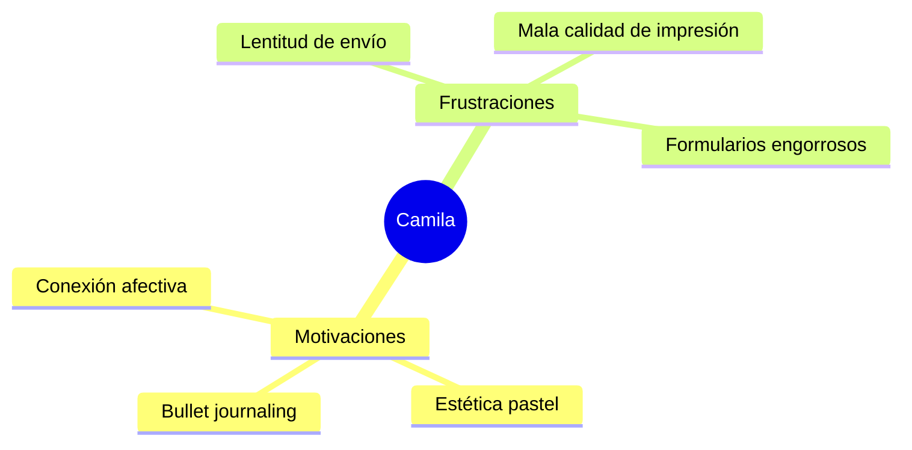
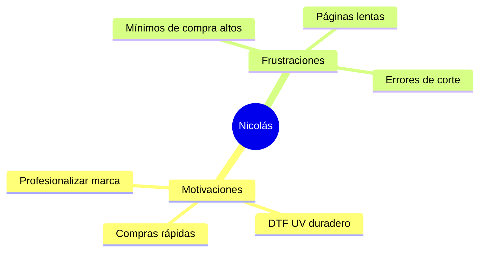
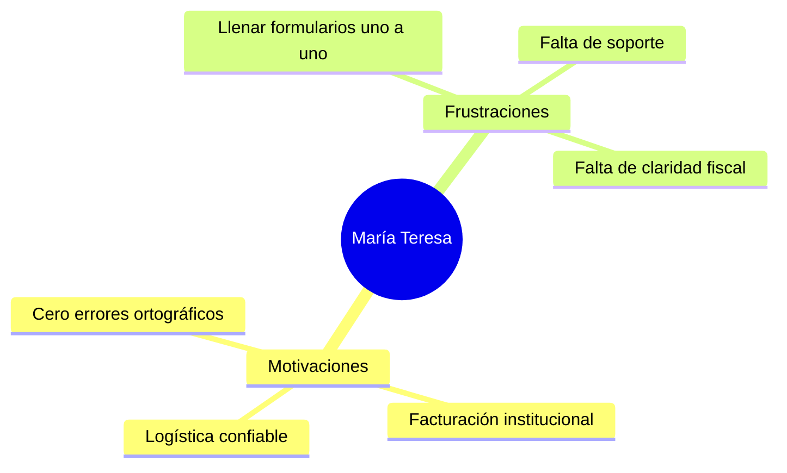

# UX Research & User Personas
## Papelería y Creaciones E&G — Estudio de Comportamiento del Usuario y Arquetipos

---

## 1. Perfiles de Clientes Principales (User Personas)

---

### Persona 1: Camila "La Detallista Emocional" (B2C)

> *"Quiero que el regalo demuestre que realmente conozco y valoro a esa persona, no quiero entregar algo genérico comprado a última hora."*

*   **Edad:** 26 años.
*   **Profesión:** Diseñadora gráfica independiente / Creadora de contenido junior.
*   **Contexto:** Camila vive en un departamento en Santiago, valora los espacios organizados y el diseño de interiores escandinavo. Le encanta coleccionar agendas y lápices, y planifica meticulosamente los regalos de cumpleaños de su familia y amigos con semanas de anticipación.
*   **Objetivos:**
    *   Preservar memorias fotográficas en álbumes físicos de alta calidad.
    *   Comprar agendas y planners que reflejen su estilo personal (tonos pastel, minimalismo).
*   **Motivaciones:** Conectar emocionalmente a través de objetos físicos; la satisfacción táctil del papel premium y los acabados en relieve.
*   **Frustraciones:**
    *   Plataformas que no permiten previsualizar cómo quedarán sus fotos en un álbum antes de pagar.
    *   Recibir cuadernos cuyas hojas traspasan la tinta de sus marcadores.
*   **Miedos:** Que el regalo llegue roto, tarde o con colores opacos distintos a los que vio en pantalla.
*   **Comportamiento Digital:** Mobile-first absoluto. Navega principalmente tarde en la noche. Acostumbrada a compras instantáneas mediante Apple Pay o Webpay OneClick.
*   **Nivel Tecnológico:** Alto. Utiliza herramientas como Canva, Notion y Figma a diario.
*   **Frecuencia de Compra:** Alta (1 a 2 veces al mes para uso personal; recurrente en fechas como San Valentín, Navidad y cumpleaños).
*   **Presupuesto Estimado:** \$15.000 - \$35.000 CLP por pedido.
*   **Productos que Compra:** Álbumes de fotos con tapas personalizadas, planners anuales, stickers de organización, packs de regalo con tazas y libretas.
*   **Qué Contenido Consume:** Videos de "Asmr de organización", vlogs de productividad, tutoriales de bullet journaling en TikTok.
*   **Qué Redes Sociales Utiliza:** Instagram, TikTok, Pinterest.
*   **Cómo Descubre la Empresa:** A través de un video viral en TikTok mostrando el unboxing de un álbum de fotos personalizado.
*   **Qué Espera Encontrar en la Web:** Una interfaz visualmente limpia, con animaciones fluidas, un constructor intuitivo para personalizar portadas y fotos, y descripciones claras del tipo de papel y gramaje.
*   **Qué Información Necesita:** Gramaje del papel, cantidad de páginas, plazos exactos de entrega y costo de envío a su comuna.
*   **Qué Preguntas Hace:** *"¿Las hojas de la libreta aguantan lápiz scripto?"*, *"¿Cuántas fotos caben en el álbum?"*, *"¿Si lo compro hoy, me llega antes del viernes?"*
*   **Qué Objeciones Tiene:** *"El precio del envío es muy alto comparado con el valor del producto"*, *"Tengo miedo de que mis fotos salgan oscuras"*.
*   **Qué la Convence de Comprar:** Ver fotos reales de otros clientes en las reseñas y un checkout que tome menos de 30 segundos.
*   **Qué la Hace Abandonar la Compra:** Formularios extensos que exigen registrarse antes de ver el precio final del envío, o una pasarela de pago que arroje error técnico.
*   **Funcionalidades Ideales:**
    *   Arrastrar y soltar fotos (Drag and Drop) directamente desde su celular al constructor del álbum.
    *   Previsualización 3D interactiva de la libreta con opción de hojear las páginas.
    *   Notificación instantánea por WhatsApp cuando el pedido salga a despacho.

---

### Persona 2: Nicolás "El Emprendedor Estético" (B2B)

> *"Mi empaque es la primera impresión física de mi marca. Si mi sticker se despega o se ve pixelado, mi cliente asume que mi producto también es de baja calidad."*

*   **Edad:** 34 años.
*   **Profesión:** Co-fundador de una microempresa de cosmética natural y jabones artesanales.
*   **Contexto:** Dirige un negocio que despacha a todo Chile desde su taller doméstico. Trabaja bajo presión constante por la falta de inventario y la necesidad de optimizar tiempos operativos.
*   **Objetivos:**
    *   Conseguir etiquetas resistentes a la humedad para sus frascos de aceites y jabones.
    *   Personalizar bolsas de embalaje y merchandising (tazas corporativas, poleras con DTF Textil) para promocionar su marca.
*   **Motivaciones:** Escalar la identidad visual de su marca para justificar un precio premium de sus productos.
*   **Frustraciones:**
    *   Imprentas industriales que le piden un mínimo de 1.000 unidades por diseño.
    *   Stickers que pierden color al contacto con aceites o agua.
*   **Miedos:** Comprar etiquetas que no calcen con las dimensiones reales de sus envases o que el adhesivo sea deficiente.
*   **Comportamiento Digital:** Híbrido (Desktop para diseñar y subir archivos complejos; Mobile para reordenar pedidos rápidos).
*   **Nivel Tecnológico:** Medio-Alto. Maneja Photoshop, Illustrator y herramientas de e-commerce como Shopify o WooCommerce.
*   **Frecuencia de Compra:** Media (Mensual o bimensual para reposición de stock de packaging).
*   **Presupuesto Estimado:** \$60.000 - \$200.000 CLP por orden de reabastecimiento.
*   **Productos que Compra:** Stickers en bobinas, etiquetas resistentes al agua, hojas de DTF UV para transferir su marca a vidrio y madera, cintas de embalaje impresas.
*   **Qué Contenido Consume:** Casos de estudio de marcas exitosas, tutoriales de empaques sustentables, tips de marketing digital para Pymes.
*   **Qué Redes Sociales Utiliza:** Instagram, LinkedIn, YouTube, grupos de emprendedores en Facebook.
*   **Cómo Descubre la Empresa:** Buscando en Google *"impresión DTF UV bajo volumen Santiago"*.
*   **Qué Espera Encontrar en la Web:** Una sección dedicada exclusivamente a emprendedores con precios por volumen claros, carga masiva de archivos vectoriales (PDF, AI) y especificaciones técnicas exactas del material.
*   **Qué Información Necesita:** Tipo de adhesivo (permanente, removible), resistencia al agua/aceite, escala de descuentos por volumen y guías de preparación de archivos (sangrías, perfiles de color).
*   **Qué Preguntas Hace:** *"¿Hacen descuentos si les pido más de 500 unidades?"*, *"¿Tienen plantilla de Illustrator para armar el lienzo de stickers?"*, *"¿Venden facturas?"*
*   **Qué Objeciones Tiene:** *"No sé si el DTF UV pegará bien en mis frascos de plástico corrugado"*, *"Tardan mucho en entregar en comparación con imprentas express"*.
*   **Qué lo Convence de Comprar:** Descargar una plantilla técnica lista para usar y que el cotizador web le calcule el precio unitario exacto por volumen.
*   **Qué lo Hace Abandonar la Compra:** El cobro obligatorio de IVA de forma sorpresiva al final del flujo, o que el cargador de archivos rechace su PDF vectorial sin explicar la razón técnica.
*   **Funcionalidades Ideales:**
    *   **"Re-order en un Click":** Botón en su panel para repetir el pedido de etiquetas del mes anterior en 3 segundos.
    *   Validador automático de archivos que compruebe la resolución y la presencia de transparencias en el lienzo.
    *   Emisión de cotizaciones en PDF automatizadas listas para aprobación interna de presupuesto.

---

### Persona 3: María Teresa "La Coordinadora Escolar" (B2B2C)

> *"Tengo la responsabilidad de 90 diplomas e igual número de regalos para la graduación. No puedo permitirme un solo nombre mal escrito ni un día de retraso."*

*   **Edad:** 48 años.
*   **Profesión:** Profesora básica y presidenta del Centro de Padres del colegio.
*   **Contexto:** Encargada de gestionar los eventos de finalización de año escolar de su institución. Trabaja con fondos recaudados con esfuerzo por los padres y rinde cuentas estrictas a la directiva del colegio.
*   **Objetivos:**
    *   Adquirir diplomas, piochas de graduación y tazas de recuerdo para tres cursos de educación básica.
    *   Asegurar que cada producto tenga el nombre correcto del alumno junto con el escudo oficial del colegio.
*   **Motivaciones:** Garantizar que la ceremonia escolar sea emotiva y libre de incidentes organizativos.
*   **Frustraciones:**
    *   Tener que ingresar los nombres de los 90 niños uno a uno en un campo de texto web.
    *   La falta de canales de comunicación humana para resolver dudas específicas de personalización.
*   **Miedos:** Recibir diplomas con faltas de ortografía o que el envío se demore hasta después del día de la ceremonia.
*   **Comportamiento Digital:** Principalmente Desktop (computador de la oficina/colegio). Su navegación es pausada.
*   **Nivel Tecnológico:** Bajo-Medio. Prefiere interfaces tradicionales con botones grandes y claros.
*   **Frecuencia de Compra:** Baja (Estacional, concentrada entre los meses de octubre y diciembre).
*   **Presupuesto Estimado:** \$150.000 - \$500.000 CLP.
*   **Productos que Compra:** Cuadros de honor, diplomas impresos en opalina premium, tazas personalizadas con la foto del curso, medallas y piochas grabadas.
*   **Qué Contenido Consume:** Blogs de educación, ideas de decoración para ceremonias escolares, recetas familiares.
*   **Qué Redes Sociales Utiliza:** Facebook, WhatsApp, correo electrónico.
*   **Cómo Descubre la Empresa:** Recomendada por una colega de otro colegio que compró las agendas institucionales el año anterior.
*   **Qué Espera Encontrar en la Web:** Una sección de "Colegios / Instituciones" con paquetes cerrados de graduación, facilidades para subir listas de nombres en formato Excel/Word y un botón visible de soporte por WhatsApp.
*   **Qué Información Necesita:** Cotizaciones formales firmadas para el colegio, métodos de facturación fiscal, plazos garantizados por escrito y muestras visuales de trabajos previos.
*   **Qué Preguntas Hace:** *"¿Puedo enviar la lista de nombres por Excel?"*, *"¿Emiten factura para el colegio?"*, *"¿Qué pasa si un diploma sale con error en el apellido de un alumno?"*
*   **Qué Objeciones Tiene:** *"Necesito la aprobación del director antes de transferir"*, *"El sistema web me parece muy enredado para procesar tantos nombres"*.
*   **Qué la Convence de Comprar:** Ver muestras físicas del trabajo anterior de E&G (o fotos muy claras) y la posibilidad de pagar mediante orden de compra del colegio.
*   **Qué la Hace Abandonar la Compra:** La falta de soporte telefónico/WhatsApp y que el cotizador no permita guardar el carrito de compras para mostrárselo a los otros apoderados en la reunión.
*   **Funcionalidades Ideales:**
    *   Carga de archivos Excel con el listado de nombres y apellidos de alumnos estructurado por campos.
    *   Guardar y Compartir Carrito: Generador de un link interactivo para que otros apoderados vean y aprueben el presupuesto preliminar en sus propios celulares.
    *   Pre-visualización de prueba: Un PDF de muestra enviado a su correo para aprobación formal antes de mandar a producción masiva.

---

## 2. Customer Intelligence Matrix

| Criterio | Camila (La Detallista) | Nicolás (El Emprendedor) | María Teresa (La Coordinadora) |
| :--- | :--- | :--- | :--- |
| **Dispositivo Principal** | Mobile (95%) | Híbrido (Desktop/Mobile) | Desktop (90%) |
| **Nivel Tecnológico** | Alto | Medio-Alto | Bajo-Medio |
| **Frecuencia de Compra** | Alta (Mensual) | Media (Reposición) | Baja (Estacional - Anual) |
| **Sensibilidad al Precio** | Media-Baja (Paga estética) | Media (Busca unitario bajo) | Alta (Presupuesto limitado) |
| **Principal Trigger de Conversión**| Previsualización e inmediatez | Plantillas técnicas y cotizador | Facturación, soporte y Excel |
| **Principal Trigger de Abandono** | Fricción en checkout / Envío caro | Falta de desglose de IVA / Error PDF| Falta de contacto humano / Complejidad |
| **Formato de Archivos** | Fotos JPG/PNG desde celular | Vectores AI/PDF transparentes | Listados en Excel, logos en JPG |

### Similitudes
*   **Necesidad de Certeza Visual:** Los tres perfiles temen el error del producto final físico. Todos necesitan previsualizar el diseño antes de presionar "Pagar".
*   **Valoración del Packaging:** La presentación física final (cajas y envoltorios) tiene un impacto directo en su satisfacción.

### Diferencias Clave
*   **Modo de Entrada de Datos:** Mientras Camila quiere subir una foto rápida desde el celular, Nicolás necesita cargar un lienzo optimizado en vectores y María Teresa un listado estructurado de texto en Excel.
*   **Documentación Fiscal:** Camila solo requiere una boleta simple de e-commerce; Nicolás y María Teresa exigen facturas fiscales chilenas para deducir impuestos o rendir cuentas a comisiones.

---

## 3. Implicaciones para el Diseño (UX Insights)

### Implicaciones para la Experiencia de Usuario (UX)
*   **Separación de Flujos desde la Home:** El diseño debe presentar tres puertas de entrada claras desde el hero section: "Para Ti" (Camila), "Para Emprendedores" (Nicolás), e "Instituciones/Colegios" (María Teresa).
*   **Flujo de Carga Adaptativo:**
    *   Si el usuario está personalizando un álbum, la interfaz de carga de imágenes debe ser ultra-simplificada para móviles.
    *   Si es una etiqueta DTF UV, la interfaz debe solicitar un archivo vectorial e incluir una "lista de verificación" técnica (DPIs, colores CMYK, transparencias).
    *   Si es un diploma escolar, debe mostrarse una grilla interactiva o un botón para subir archivos `.xlsx` / `.csv`.
*   **Función "Guardar Presupuesto para Reunión":** Un botón de guardado que genere un PDF o un enlace seguro para compartir por WhatsApp. Esto resuelve el dolor de María Teresa (aprobación grupal) y Nicolás (aprobación de socios).

### Implicaciones para la Interfaz de Usuario (UI)
*   **Diseño "Estudio Creativo":** El look & feel debe alejarse de un e-commerce estático como AliExpress y asemejarse más a un estudio moderno tipo Canva o Linear. Fondo claro con micro-animaciones (Framer Motion) en los botones de carga para dar sensación de artesanía digital.
*   **Feedback visual en tiempo real:** Uso de loaders animados que simulen el procesamiento de la imagen subida por el usuario para mitigar la ansiedad de carga.

### Implicaciones para la Arquitectura y Base de Datos
*   **Entidad `Order` Flexible:** La tabla `orders` en PostgreSQL debe manejar metadatos complejos (`jsonb` de Supabase) para almacenar tanto los enlaces de imágenes de Camila, los vectores listos de Nicolás, como el array de nombres de María Teresa.
*   **Almacenamiento Optimizado (Supabase Storage):** Implementar compresión automática de imágenes en el cliente (Client-Side Compression) antes de subirlas al bucket para evitar saturar el almacenamiento con archivos pesados innecesarios de Camila. Para los vectores de Nicolás, mantener el archivo intacto para evitar pérdida de resolución en producción.

### Implicaciones para SEO
*   **Páginas de Destino Dedicadas (Landing Pages):** Crear landing pages con SEO de nicho específico:
    *   `/soluciones/dtf-uv-para-emprendedores` (Orientado a Nicolás).
    *   `/servicios/regalos-graduacion-colegios` (Orientado a María Teresa).
    *   `/categoria/albumes-fotos-personalizados` (Orientado a Camila).
