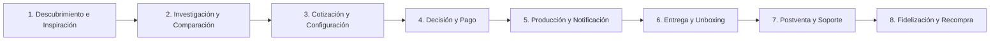

# Customer Journey Map & Product Requirements
## Papelería y Creaciones E&G — Análisis de la Experiencia del Cliente y Requerimientos de Producto

---

## 1. Fases del Customer Journey

Para abarcar el comportamiento omnicanal y las necesidades de personalización, el viaje del cliente se divide en **8 macro-fases estructuradas**:



---

### Fase 1: Descubrimiento e Inspiración

*   **Objetivo del cliente:** Encontrar ideas para un regalo especial o descubrir insumos para su marca.
*   **Qué piensa:** *"Qué lindo este video de etiquetas para botellas, ¿cómo lo habrán hecho?"*
*   **Qué siente:** Curiosidad, inspiración, optimismo creativo.
*   **Qué hace:** Da scroll en Reels de Instagram o TikTok, guarda publicaciones de unboxing en Pinterest.
*   **Qué necesita:** Contenido altamente visual y estético que muestre el acabado real del producto.
*   **Qué espera:** Entender rápidamente si la marca despacha a su región (Chile) y si vende por unidad o volumen.
*   **Qué preguntas se hace:** *"¿Será una tienda chilena confiable?"*, *"¿Venderán al por menor?"*
*   **Qué dispositivos utiliza:** Smartphone (95%), Tablet (5%).
*   **Qué canales utiliza:** TikTok, Instagram, Pinterest.
*   **Qué información necesita:** Nombre de la marca, categoría general de productos, país/ciudad de operación.
*   **Qué obstáculos encuentra:** Enlaces rotos en la biografía de Instagram, falta de precios referenciales en las publicaciones.
*   **Qué emociones predominan:** Entusiasmo ligero.
*   **Nivel de confianza:** Bajo (Aún no conoce la marca).
*   **Nivel de satisfacción:** Medio.
*   **Riesgos de abandono:** Alto (Si el link de la biografía no carga rápido o si la estética del sitio web no coincide con la calidad de sus redes sociales).
*   **Oportunidades de mejora:** Tener una Landing Page con carga inferior a 1 segundo que conecte directamente el video de la red social con el producto exacto.
*   **Funcionalidades asociadas:**
    *   Integración de feed interactivo *"Comprar el Look / Instagram Shop"*.
*   **Indicadores (KPIs):** Tasa de clics (CTR) en la biografía, rebote de la Landing Page.

---

### Fase 2: Investigación y Comparación

*   **Objetivo del cliente:** Evaluar si E&G cumple con sus necesidades específicas y comparar precios/calidad frente a competidores.
*   **Qué piensa:** *"¿La opalina que usan será lo suficientemente gruesa para mi agenda?"*, *"¿Qué dicen otros clientes sobre sus tiempos de despacho?"*
*   **Qué siente:** Cautela, analítico, deseo de no cometer un error en la compra.
*   **Qué hace:** Visita la sección "Nosotros", busca opiniones de otros clientes, revisa el catálogo web.
*   **Qué necesita:** Fichas técnicas claras, imágenes macro de texturas del papel, fotos reales de trabajos terminados.
*   **Qué espera:** Encontrar pruebas sociales (opiniones) y especificaciones en un lenguaje comprensible.
*   **Qué preguntas se hace:** *"¿Los stickers de DTF UV resisten el lavavajillas?"*, *"¿Hacen facturas?"*
*   **Qué dispositivos utiliza:** Híbrido (Smartphone / Desktop para Pymes).
*   **Qué canales utiliza:** Sitio Web, Google Search, Google Maps Reviews.
*   **Qué información necesita:** Fichas de producto detalladas, tabla de precios por volumen, opiniones certificadas.
*   **Qué obstáculos encuentra:** Descripciones escuetas tipo *"taza personalizada"* sin indicar material, capacidad, ni si es apta para microondas.
*   **Qué emociones predominan:** Duda racional.
*   **Nivel de confianza:** Medio-Bajo.
*   **Nivel de satisfacción:** Medio.
*   **Riesgos de abandono:** Medio (Si no encuentra especificaciones técnicas o si la sección de reviews parece falsa).
*   **Oportunidades de mejora:** Incluir un widget interactivo de opiniones verificadas que permita filtrar por tipo de producto.
*   **Funcionalidades asociadas:**
    *   Reseñas con soporte de imágenes subidas por el cliente.
    *   Descarga directa de Fichas Técnicas en PDF.
*   **Indicadores (KPIs):** Páginas vistas por sesión, tiempo promedio de permanencia en la página de producto.

---

### Fase 3: Cotización y Configuración (Personalización)

*   **Objetivo del cliente:** Configurar su producto a medida y conocer el precio final exacto de inmediato.
*   **Qué piensa:** *"Ojalá pudiera ver cómo se ve mi logo en esta bolsa antes de comprar"* o *"Quiero subir los nombres de mis alumnos sin tener que escribir uno por uno"*.
*   **Qué siente:** Ansiedad creativa, temor a cometer errores ortográficos o de diseño.
*   **Qué hace:** Sube archivos de imagen, escribe textos de personalización, arrastra fotos al lienzo interactivo.
*   **Qué necesita:** Un configurador visual responsivo que calcule el precio dinámicamente.
*   **Qué espera:** Que la herramienta le advierta si la imagen es apta para impresión o si saldrá pixelada.
*   **Qué preguntas se hace:** *"¿Mi logo está centrado?"*, *"¿Si subo un Excel con nombres lo leerán bien?"*
*   **Qué dispositivos utiliza:** Mobile para regalos rápidos; Desktop para emprendedores e instituciones.
*   **Qué canales utiliza:** Configurador web integrado.
*   **Qué información necesita:** Medidas del área de impresión, formato de archivo aceptado (PNG, PDF, AI), límite de caracteres.
*   **Qué obstáculos encuentra:** Herramientas de carga lentas que se caen en la mitad del proceso, falta de guías visuales de sangrado y corte.
*   **Qué emociones predominan:** Ansiedad moderada.
*   **Nivel de confianza:** Medio.
*   **Nivel de satisfacción:** Bajo-Medio (Suele ser el punto de mayor fricción).
*   **Riesgos de abandono:** Muy Alto (Si la herramienta es compleja de usar en móviles o el validador rechaza el archivo sin instrucciones claras).
*   **Oportunidades de mejora:** Diseñar un validador de imágenes ligero en el navegador que compruebe la transparencia y la resolución del archivo al instante.
*   **Funcionalidades asociadas:**
    *   Previsualizador 2D dinámico.
    *   Validador interactivo de archivos de carga.
    *   Lector de planillas Excel (.xlsx) para nombres de diplomas/regalos escolares.
*   **Indicadores (KPIs):** Tasa de éxito en la subida de archivos, tiempo de finalización del configurador.

---

### Fase 4: Decisión y Pago

*   **Objetivo del cliente:** Confirmar la orden, ingresar los datos de entrega y realizar la transacción financiera de forma segura.
*   **Qué piensa:** *"¿Es seguro este sitio?"*, *"¿El costo de envío es justo?"*, *"¿Puedo pagar con cuenta RUT?"*
*   **Qué siente:** Vulnerabilidad financiera, deseo de finalizar rápido la transacción.
*   **Qué hace:** Rellena campos de dirección de envío, selecciona operador de reparto, ingresa credenciales bancarias.
*   **Qué necesita:** Pasarela de pago integrada que soporte Webpay y billeteras digitales, desglose transparente de costos de despacho.
*   **Qué espera:** Recibir un comprobante digital inmediato con el número de orden y confirmación de la fecha de entrega prometida.
*   **Qué preguntas se hace:** *"¿Y si el envío no llega en el día comprometido?"*, *"¿Dónde reclamo si el cobro se duplica?"*
*   **Qué dispositivos utiliza:** Smartphone / Desktop.
*   **Qué canales utiliza:** Checkout de la plataforma web, pasarela de pago (Transbank/MercadoPago).
*   **Qué información necesita:** Costo exacto de despacho por comuna, tiempo estimado de tránsito, políticas de reembolso y garantías.
*   **Qué obstáculos encuentra:** Costos de despacho ocultos que aparecen solo en la última pantalla, pasarelas de pago externas lentas que fallan al redireccionar.
*   **Qué emociones predominan:** Expectación.
*   **Nivel de confianza:** Medio-Alto (Si el checkout se siente premium y seguro).
*   **Nivel de satisfacción:** Medio.
*   **Riesgos de abandono:** Alto (Si el costo de envío es desproporcionado respecto al valor del producto).
*   **Oportunidades de mejora:** Implementar cálculo automático de despacho mediante APIs logísticas locales integradas en tiempo real.
*   **Funcionalidades asociadas:**
    *   Cálculo geolocalizado de tarifas de envío.
    *   Checkout express en un click para usuarios registrados.
*   **Indicadores (KPIs):** Tasa de conversión de checkout, tasa de abandono de carrito.

---

### Fase 5: Producción y Notificación

*   **Objetivo del cliente:** Conocer en qué estado está su pedido personalizado sin tener que enviar correos ni escribir por WhatsApp.
*   **Qué piensa:** *"¿Habrán empezado a hacer mi pedido?"*, *"¿Les habrá gustado la foto que subí?"*
*   **Qué siente:** Ansiedad de espera, impaciencia.
*   **Qué hace:** Revisa su correo electrónico, ingresa al panel de usuario o consulta el bot de WhatsApp.
*   **Qué necesita:** Actualizaciones transparentes sobre la etapa en la que se encuentra su pedido (ej. "En Diseño", "En Impresión", "En Empaque").
*   **Qué espera:** Que se respeten los plazos informados al comprar.
*   **Qué preguntas se hace:** *"¿Estará listo para la fecha que necesito?"*
*   **Qué dispositivos utiliza:** Principalmente Smartphone (para alertas de notificación).
*   **Qué canales utiliza:** Email, WhatsApp Notifications, Panel de Usuario de la Plataforma.
*   **Qué información necesita:** Etapa de producción actual, fecha proyectada de entrega.
*   **Qué obstacles encuentra:** Cero comunicación de la tienda desde el momento del pago hasta el despacho, lo que obliga al cliente a preguntar manualmente.
*   **Qué emociones predominan:** Incertidumbre.
*   **Nivel de confianza:** Fluctuante (Tiende a bajar si la marca guarda silencio por más de 48 horas).
*   **Nivel de satisfacción:** Bajo (En el flujo actual).
*   **Riesgos de abandono:** Nulo (El pago ya fue realizado), pero alto riesgo de detracción de marca y saturación en los canales de atención al cliente.
*   **Oportunidades de mejora:** Un sistema automatizado de estados de pedido alimentado directamente desde el panel de producción del taller.
*   **Funcionalidades asociadas:**
    *   Pipeline de estados en tiempo real (Tracker visual tipo envío de comida a domicilio).
    *   Integración de notificaciones automáticas vía WhatsApp Cloud API.
*   **Indicadores (KPIs):** Reducción en tickets de soporte del tipo *"¿dónde está mi pedido?"*.

---

### Fase 6: Entrega y Unboxing

*   **Objetivo del cliente:** Recibir el pedido en perfectas condiciones y experimentar satisfacción al abrirlo.
*   **Qué piensa:** *"Qué lindo el empaque"*, *"El acabado de la taza quedó perfecto"* o *"Esto le va a encantar a mi cliente final"*.
*   **Qué siente:** Alegría, alivio, validación del gasto.
*   **Qué hace:** Abre el paquete, revisa detalladamente las uniones, costuras y colores, toma fotos o graba videos de unboxing.
*   **Qué necesita:** Un empaque seguro que proteja el producto y que contenga elementos de branding atractivos (tarjeta de agradecimiento, stickers de regalo).
*   **Qué espera:** Que el producto se vea igual o mejor que en la pantalla.
*   **Qué preguntas se hace:** *"¿Cómo se lava esto para que no se gaste?"*, *"¿Dónde los puedo calificar?"*
*   **Qué dispositivos utiliza:** Smartphone (Cámara).
*   **Qué canales utiliza:** Recepción física, Instagram Stories (para etiquetar a la marca).
*   **Qué información necesita:** Instrucciones de cuidado del producto personalizado (ej. lavado a mano para sublimación).
*   **Qué obstáculos encuentra:** Cajas abolladas por mal manejo del transporte, productos sueltos sin protección, ausencia de guías de cuidado.
*   **Qué emociones predominan:** Placer visual, alivio.
*   **Nivel de confianza:** Alto.
*   **Nivel de satisfacción:** Muy Alto (Si el empaque y el producto cumplen la promesa).
*   **Riesgos de abandono:** Nulo en esta compra, pero define si habrá recompra o recomendación en el futuro.
*   **Oportunidades de mejora:** Incluir un código QR en la tarjeta de agradecimiento que dirija a instrucciones detalladas de uso y un enlace directo para dejar una reseña calificada.
*   **Funcionalidades asociadas:**
    *   Página de soporte interactiva post-entrega con guías de cuidado.
*   **Indicadores (KPIs):** Net Promoter Score (NPS), menciones orgánicas en redes sociales.

---

### Fase 7: Postventa y Soporte

*   **Objetivo del cliente:** Resolver un inconveniente con el pedido (ej. un nombre mal escrito o un producto dañado en el transporte) de forma rápida y sin burocracia.
*   **Qué piensa:** *"Ojalá me respondan rápido y no se deslinden de la responsabilidad"* o *"Solo quiero que me repongan el diploma dañado"*.
*   **Qué siente:** Frustración, desconfianza reactiva.
*   **Qué hace:** Envía mensajes al canal de soporte adjuntando fotos del defecto.
*   **Qué necesita:** Respuestas resolutivas, políticas de garantía claras y un canal directo de comunicación rápida.
*   **Qué espera:** Que el proceso de reposición sea ágil y gratuito si el error fue de la tienda o del transporte.
*   **Qué preguntas se hace:** *"¿Me van a cobrar por el envío de reemplazo?"*, *"¿Tengo que devolver el producto fallido?"*
*   **Qué dispositivos utiliza:** Smartphone / Desktop.
*   **Qué canales utiliza:** Formulario de soporte de la web, canal oficial de WhatsApp de soporte.
*   **Qué información necesita:** Estado del reclamo, tiempos de fabricación y envío del reemplazo.
*   **Qué obstáculos encuentra:** Respuestas defensivas de la tienda, demora en la lectura de correos, cobros extra por reenvío.
*   **Qué emociones predominan:** Frustración.
*   **Nivel de confianza:** Muy Bajo (Etapa crítica de recuperación del cliente).
*   **Nivel de satisfacción:** Bajo.
*   **Riesgos de abandono:** Máximo (Riesgo de daño permanente de marca a través de comentarios negativos en redes sociales).
*   **Oportunidades de mejora:** Automatizar la creación de tickets de reposición directamente desde el panel del cliente facilitando la carga de la foto del error.
*   **Funcionalidades asociadas:**
    *   Centro de resolución de problemas autogestionado.
    *   Generador automático de órdenes de reposición internas a coste cero.
*   **Indicadores (KPIs):** Tiempo de primera respuesta (FRT), Tasa de resolución al primer contacto (FCR).

---

### Fase 8: Fidelización y Recompra

*   **Objetivo del cliente:** Adquirir nuevos productos personalizados o reabastecer sus insumos recurrentes con beneficios por su lealtad.
*   **Qué piensa:** *"Ya sé que trabajan bien, ahora necesito hacer las agendas de este año"* o *"Debo reponer las etiquetas de mi emprendimiento"*.
*   **Qué siente:** Comodidad, pertenencia, confianza consolidada.
*   **Qué hace:** Inicia sesión, accede a sus diseños guardados, aplica cupones de fidelización.
*   **Qué necesita:** Descuentos para clientes frecuentes, catálogo actualizado según temporada, acceso rápido a su historial de archivos.
*   **Qué espera:** Que la recompra sea aún más rápida y fluida que la primera transacción.
*   **Qué preguntas se hace:** *"¿Tendrán algún descuento por ser cliente frecuente?"*, *"¿Estará guardado el logotipo de mi Pyme?"*
*   **Qué dispositivos utiliza:** Smartphone / Desktop.
*   **Qué canales utiliza:** Email Marketing (Boletines segmentados), Área de Cliente Web.
*   **Qué información necesita:** Nuevos lanzamientos, saldo de puntos de fidelidad, historial de pedidos previos.
*   **Qué obstáculos encuentra:** Olvidar sus datos de acceso, que sus logotipos hayan sido borrados del servidor, o no recibir ofertas relevantes.
*   **Qué emociones predominan:** Satisfacción recurrente.
*   **Nivel de confianza:** Alto.
*   **Nivel de satisfacción:** Alto.
*   **Riesgos de abandono:** Bajo (A menos que un competidor ofrezca una herramienta de personalización drásticamente superior o precios agresivos).
*   **Oportunidades de mejora:** Crear un programa de puntos por compras ("Creaciones Club") y almacenar de forma segura los archivos vectoriales del cliente para reordenar sin esfuerzo.
*   **Funcionalidades asociadas:**
    *   Bóveda de archivos del cliente (Cloud Vault para logos y assets de Pymes).
    *   Programa de lealtad y puntos de descuento.
*   **Indicadores (KPIs):** Tasa de recompra mensual, Valor de vida del cliente (LTV).

---

## 2. Moments of Truth (Momentos de la Verdad)

### Momento 1: La Primera Previsualización (Momento "Aha!")
*   **Qué es:** El instante en que el cliente ve plasmada su foto o logotipo en el render digital 2D del producto.
*   **Impacto:** Crítico para la confianza. Si el render se ve realista y el configurador responde de forma ágil, el cliente experimenta la certeza del resultado final, desbloqueando el impulso de compra.

### Momento 2: La Revelación del Envío (Momento del "Dolor")
*   **Qué es:** La pantalla de checkout donde se suma la tarifa de despacho a la orden.
*   **Impacto:** Si el precio de despacho se siente inflado o no fue anticipado adecuadamente en pantallas previas, destruye la confianza inmediatamente, provocando el abandono definitivo del carrito de compras.

### Momento 3: La Primera Notificación Post-Pago (Momento del "Silencio")
*   **Qué es:** Las primeras 24 horas después de pagar.
*   **Impacto:** Recibir una confirmación detallada por correo o WhatsApp que explique los siguientes pasos de producción infunde calma. El silencio total del e-commerce tradicional genera ansiedad e incentiva que el cliente recurra a llamadas o mensajes de soporte.

### Momento 4: La Apertura del Paquete (El Unboxing)
*   **Qué es:** El momento físico de la verdad.
*   **Impacto:** El empaque debe deleitar. Si la caja contiene detalles personalizados (ej: tarjetas escritas, stickers de regalo), se logra el paso del cliente satisfecho al cliente promotor que comparte su experiencia de forma gratuita en redes sociales.

---

## 3. Matriz de Pain Points (Puntos de Dolor)

| ID | Problema | Impacto | Frecuencia | Prioridad | Solución Tecnológica Recomendada |
| :--- | :--- | :--- | :--- | :--- | :--- |
| **PP-01** | Incertidumbre sobre el resultado final del producto personalizado. | Crítico | Alta | **Alta** | Previsualizador interactivo 2D responsivo en el navegador con actualización instantánea de variantes. |
| **PP-02** | Cotizaciones manuales tardías y demoras por WhatsApp. | Medio | Alta | **Alta** | Cotizador dinámico en tiempo real integrado en las páginas de variantes de producto de la web. |
| **PP-03** | Subida de archivos con baja resolución o formatos erróneos. | Crítico | Media | **Alta** | Validador del lado del cliente (Client-side) que verifique DPIs y transparencias antes de la subida. |
| **PP-04** | Ingreso manual tedioso de listas de nombres de graduaciones. | Alto | Baja | **Media** | Parser del lado del cliente para hojas Excel (.xlsx) que autocomplete las variantes en el checkout. |
| **PP-05** | Incertidumbre sobre la fecha exacta y estado de envío del paquete. | Alto | Alta | **Media** | Módulo de tracking de pedidos y notificaciones automáticas transaccionales por WhatsApp. |

---

## 4. Opportunity Map (Mapa de Oportunidades)

```text
Problema: Cotizaciones lentas en WhatsApp que congelan la compra.
↓
Funcionalidad: Motor de cotización dinámica basado en volumen y variantes.
↓
Beneficio Cliente: Obtiene precios unitarios reales y facturables de inmediato.
↓
Beneficio Negocio: Aumento del valor promedio de la orden (AOV) y eliminación del soporte manual operativo.

---

Problema: Miedo al error ortográfico en diplomas institucionales.
↓
Funcionalidad: Validador y parser de Excel con visualización en grilla editable antes del pago.
↓
Beneficio Cliente: Control total sobre los nombres impresos sin duplicar trabajo.
↓
Beneficio Negocio: Reducción del 99% de reposiciones por errores ortográficos y fidelización B2B2C.
```

---

## 5. Plan de Automatizaciones Estratégicas

1.  **Cotizador en Tiempo Real:** Elimina la cotización vía chat. Los precios se recalculan en tiempo real usando fórmulas almacenadas en la base de datos según tamaño, material y cantidad.
2.  **Validación Técnica de Imágenes:** Un script analiza las dimensiones en píxeles y el canal alfa (transparencia) del archivo del cliente. Si detecta problemas, bloquea temporalmente el envío e instruye cómo corregirlo de forma amigable.
3.  **Hojas de Trabajo para Taller (Production Job Sheets):** Al confirmarse el pago de un pedido, el sistema genera automáticamente un archivo PDF que reúne la orden, los nombres formateados, la dirección de despacho y el link de descarga directa del asset en alta resolución desde Supabase Storage. El taller solo imprime y corta, sin intermediación de diseñadores.
4.  **Flujo Automatizado de Encuestas y Reseñas:** 5 días después de que el Courier marque el pedido como "Entregado", el sistema envía un WhatsApp al cliente solicitando una reseña con foto de su experiencia, ofreciendo un cupón de descuento automatizado para su próxima compra.

---

## 6. Implicaciones para el Diseño

### UX (Experiencia de Usuario)
*   **Reducción del estrés cognitivo:** El flujo de personalización debe ir de menos a más. Primero se selecciona la cantidad y el tamaño (decisiones fáciles), luego el archivo de diseño, y finalmente el método de entrega.
*   **Checkout sin salida:** Eliminar el Header y Footer estándar en la pantalla de pago para concentrar al usuario únicamente en concretar la transacción.

### UI (Interfaz de Usuario)
*   **Micro-interacciones táctiles:** Transiciones suaves al deslizar fotos al lienzo, feedback en colores verdes suaves para cargas de archivo exitosas y alertas rojas explicativas cuando el validador de diseño detecta fallos.
*   **Modo Enfoque:** Visualizadores con fondos grises neutros que permitan apreciar los colores reales de los productos sin distracción cromática de la interfaz general.

### Arquitectura de Base de Datos
*   **Tablas de Precios Dinámicos:** La tabla `product_prices` debe almacenar reglas de precios volumétricos por tramos (ej: 1-10 uds: \$1000; 11-50 uds: \$800; >50 uds: \$500) para alimentar al motor de cotización del frontend de forma consistente y segura.

---

## 7. Product Requirements (Registro de Funcionalidades)

| ID | Nombre Funcionalidad | Prioridad | Impacto | Complejidad | Versión Sugerida |
| :--- | :--- | :--- | :--- | :--- | :--- |
| **FR-01** | Cotizador Dinámico por Volumen | Alta | Crítico | Media | v1.0 (MVP) |
| **FR-02** | Cargador y Validador de Imágenes del Cliente | Alta | Crítico | Alta | v1.0 (MVP) |
| **FR-03** | Parser de Listados Excel para Nombres Masivos | Media | Alto | Media | v1.1 (Fase 1) |
| **FR-04** | Tracker de Estados de Producción en Tiempo Real | Media | Alto | Baja | v1.0 (MVP) |
| **FR-05** | Bóveda Cloud de Archivos y Diseños del Cliente | Baja | Medio | Alta | v1.2 (Fase 2) |
| **FR-06** | Generador Automático de Fichas de Impresión (PDF) | Alta | Crítico | Media | v1.0 (MVP) |
| **FR-07** | Link de Carrito Compartido para Aprobación | Media | Medio | Baja | v1.1 (Fase 1) |
| **FR-08** | Notificaciones Transaccionales Automatizadas por WhatsApp | Alta | Alto | Media | v1.0 (MVP) |
