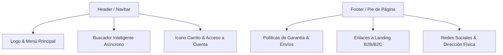

# Arquitectura de la Información & Estructura Funcional
## Papelería y Creaciones E&G — Plano Estructural de la Plataforma

---

## 1. Sitemap General

La plataforma se organiza en tres grandes áreas de navegación independientes: **Área Pública (E-commerce & Branding)**, **Área del Cliente (Autogestión)** y **Área Administrativa (Taller & Operaciones)**.

```text
/ (Inicio)
├── nosotros
├── catálogo
│   ├── [categoria-slug]/
│   │   └── [producto-slug] (Detalle de Producto & Personalizador)
│   └── buscar (Buscador y filtros asíncronos)
├── corporativos (Landing B2B para Pymes)
├── colegios (Landing B2B2C para Instituciones)
├── blog (Contenido de valor MDX/Supabase)
│   └── [articulo-slug]
├── ayuda (FAQ & Centro de Resolución)
├── contacto
├── carrito (Página intermedia de confirmación local)
└── checkout (Caja, cálculo de envío, pasarela)
    └── exito (Confirmación de compra y número de orden)

/mi-cuenta/ (Área del Cliente)
├── login (Ingreso, Registro, Google Auth)
├── dashboard (Vista de bienvenida, estado de último pedido)
├── pedidos
│   └── [pedido-id] (Detalle, tracker de producción, descarga de boleta)
├── direcciones (Libreta de direcciones guardadas)
└── disenos (Bóveda de archivos vectoriales e imágenes del cliente)

/admin/ (Panel Administrativo - Acceso restringido por Rol)
├── dashboard (Métricas de ventas, pedidos urgentes en taller, uso de almacenamiento)
├── inventario
│   ├── productos (CRUD de artículos, variantes y stock)
│   ├── categorias (Gestión de taxonomías de catálogo)
│   └── colecciones (Agrupaciones estacionales ej: Regreso a Clases)
├── taller (Visualizador de órdenes listas para imprimir, generación de Job Sheets)
├── pedidos (Gestión de envíos, devoluciones y tickets de soporte)
├── cotizaciones (Gestión y respuesta de presupuestos corporativos)
├── clientes (Perfiles B2C y B2B, historial de facturación)
├── blog-admin (Publicación de artículos y edición de metadata SEO)
├── configuracion (Configuración del valor de despachos, tokens de APIs y backups de base de datos)
└── logs (Auditoría de acciones de usuarios y fallos de sistema)
```

---

## 2. Jerarquía de Páginas Clave

---

### Home (`/`)
*   **Objetivo:** Captar el interés de los tres tipos de clientes (Camila, Nicolás, María Teresa), transmitir la propuesta de valor emocional y guiar hacia los embudos de conversión correctos.
*   **Información:** Hero section con llamada a la acción clara, grid de categorías principales, carrusel de productos más vendidos, sección de testimonios e introducción al configurador de personalización.
*   **Acciones:** Click en CTAs de redirección a landings específicas, click en productos destacados, suscripción al boletín de ofertas.
*   **Componentes Principales:** `HeroSection`, `CategoryGrid`, `TestimonialCarousel`, `CTASection`.
*   **Dependencias:** API de Supabase (Categorías activas y testimonios recomendados).
*   **SEO:** Title: *Papelería y Creaciones E&G | Detalles que Inspiran, Creaciones que Conectan*. Meta Description: *Especialistas en papelería personalizada, regalos con sentido, stickers de alta resistencia y soluciones de marca para Pymes y colegios en Chile.*

---

### Ficha de Detalle de Producto & Personalizador (`/catálogo/[categoria-slug]/[producto-slug]`)
*   **Objetivo:** Permitir la compra directa del producto estándar o iniciar el flujo de configuración avanzada a medida.
*   **Información:** Galería de imágenes en alta resolución, selector de variantes (material, tamaño, color), información de stock en tiempo real, cotizador dinámico por volumen y cargador de archivos del cliente.
*   **Acciones:** Modificar variante, cambiar cantidad, subir archivo (.png, .pdf, .xlsx), previsualizar diseño, añadir al carrito.
*   **Componentes Principales:** `ImageGallery`, `VariantSelector`, `VolumePriceCalculator`, `CustomizerCanvas`, `FileUploadZone`.
*   **Dependencias:** Supabase Storage (Subida temporal de assets), Base de datos (Reglas de precios y stock).
*   **SEO:** Dynamic Metadata basada en el título del producto. Canonical URL apuntando a la ruta limpia. Schema Product (JSON-LD) con datos de precio, disponibilidad y reseñas.

---

### Checkout (`/checkout`)
*   **Objetivo:** Concretar la transacción cobrando el producto y los costes de despacho asociados sin distracciones.
*   **Información:** Desglose del carrito, formulario de facturación/despacho, selector de Courier integrado, interfaz de pago seguro.
*   **Acciones:** Ingresar dirección (o seleccionar de libreta), elegir método de envío, aplicar cupón de descuento, autorizar pago.
*   **Componentes Principales:** `OrderSummary`, `ShippingForm`, `CourierRatesSelector`, `PaymentProcessorGateway`.
*   **Dependencias:** API BlueExpress/Starken/Chilexpress (Tarifas dinámicas), Pasarela Webpay/MercadoPago.
*   **SEO:** No Index / No Follow (Página transaccional protegida).

---

## 3. Arquitectura de Navegación



*   **Menú Móvil:** Desplegable tipo *Sheet* (lateral izquierdo) con optimización táctil. Acceso inmediato a categorías y un botón destacado para soporte rápido por WhatsApp.
*   **Barra de Búsqueda:** Buscador predictivo que despliega miniaturas de productos al escribir 3 caracteres (Debounce de 300ms para no saturar el backend).

---

## 4. Arquitectura del Dashboard Administrativo (`/admin/*`)

El panel de administración se concibe como una herramienta de flujo de trabajo operativo diaria, organizada en 3 grandes bloques de control:

### Bloque A: Operación e Inventario
1.  **Dashboard Ejecutivo:** Gráficos de facturación mensual, volumen de ventas por categoría, total de gigabytes consumidos en Supabase Storage y listado de pedidos críticos con fecha de entrega inferior a 48 horas.
2.  **Inventario (CRUD):** Gestión de productos agregando variantes complejas y enlazando archivos técnicos de plantilla (ej. lienzos de Illustrator para Nicolás).
3.  **Gestión de Taxonomías:** CRUD de categorías, subcategorías y colecciones dinámicas (ej: Habilitar temporalmente banner navideño).

### Bloque B: Fulfillment y Taller (Core Operativo)
1.  **Vista de Taller (Triage):** Un tablero Kanban donde los pedidos fluyen a través de: `Por Diseñar` ➔ `Listo para Impresión` ➔ `En Corte` ➔ `En Control de Calidad` ➔ `Listo para Courier`.
2.  **Generación de Job Sheets (Fichas Técnicas):** Botón para exportar un PDF con la orden de trabajo consolidando todos los archivos de diseño subidos por el cliente en alta resolución para evitar descargas manuales dispersas.
3.  **Despacho y Seguimiento:** Conexión con los Couriers para generar etiquetas de envío (Etiquetas térmicas) y actualizar de forma automatizada los tracking numbers en la cuenta del cliente.

### Bloque C: Seguridad, Ajustes y Logs
1.  **Configuración de Variables de Sistema:** Control manual de tarifas base de despacho, desactivación del sitio por mantenimiento y ajustes de integraciones.
2.  **Administrador de Roles y Permisos:** Control de accesos basado en roles (RBAC): `Admin` (Control total), `Operario de Taller` (Solo ve la cola de impresión y estados de pedidos), `Diseñador` (Acceso a validación de archivos e inventario).
3.  **Logs de Auditoría de Sistema:** Registro de actividades críticas: quién modificó el stock, quién descargó un Excel de clientes, y fallas críticas del sistema.

---

## 5. Contenido Dinámico Administrable (Supabase DB)

La base de datos PostgreSQL en Supabase actuará como el Headless CMS de la aplicación, controlando dinámicamente los siguientes elementos de la interfaz:

| Módulo de Interfaz | Campos Administrables en BD | Frecuencia de Cambio |
| :--- | :--- | :--- |
| **Banners de Promoción** | Imagen (Desktop/Mobile), URL de destino, Color de fondo (Hex), Estado Activo (Bool). | Semanal |
| **Preguntas Frecuentes (FAQ)** | Categoría (ej: Envíos, Pagos), Pregunta (Texto), Respuesta (Markdown), Orden (Int). | Mensual |
| **Testimonios de Clientes** | Nombre del cliente, Rol/Pyme, Reseña (Texto), Calificación (1-5), Aprobado (Bool). | Quincenal |
| **Packs Escolares/Corporativos**| Nombre del Pack, Lista de Productos Incluidos, Descuento Aplicado (%). | Estacional |

---

## 6. Arquitectura SEO

*   **Estructura de URLs Limpias:**
    *   Categorías: `/catálogo/stickers`, `/catálogo/regalos-corporativos`.
    *   Productos: `/catálogo/stickers/dtf-uv-personalizado`.
*   **Metadata Dinámica:** Implementada mediante la función `generateMetadata` de Next.js en Server Components, inyectando meta tags para redes sociales (Open Graph / Twitter Cards) usando imágenes de producto hospedadas en Supabase Storage como imágenes de portada de forma automática.
*   **Esquemas estructurados (Schemas JSON-LD):**
    *   `Product Schema` en las fichas de detalle.
    *   `Organization Schema` en la página de inicio y contacto.
    *   `FAQPage Schema` en el centro de ayuda para que Google indexe las preguntas directamente en los resultados de búsqueda.
*   **Canonical Tags:** Inyección automatizada de etiquetas `<link rel="canonical" href="..." />` para prevenir problemas de contenido duplicado causados por los filtros y parámetros de ordenamiento de la URL.
